# D6 System Second Edition User Manual

This manual describes the functionality currently available in the
**D6 System Second Edition** system for Foundry Virtual Tabletop v14. It is a
living manual: implemented workflows are documented here in the same change
that introduces or changes them.

> **Rules and licensing:** This manual explains how to operate the VTT. It uses
> concise rules summaries and printed-page references rather than reproducing
> rulebook prose. `D62e` refers to _D6 System: Second Edition_ v1.1. `OD6`
> refers to the supplied _OpenD6 Space_ rulebook.

### Find what you need

- **Gamemaster setting up a world:** begin with **1. Start Here**, then read
  **2. Game System Mode and Rules** and **9. Campaign Configuration
  Reference**.
- **Player joining a campaign:** begin with **1. Start Here**, then use
  **3. Character Sheet and Modes**, **4. Character Creation**, and **5. Rolls,
  Wild Die, and Chat Cards**.
- **During play:** use **6. Advancement**, **7. Traits, Equipment, and Item
  Sheets**, and **8. Combat and Conditions**.
- **Configuring homebrew or specialized campaign workspaces:** use **10.
  Optional Campaign Workspaces**.
- **Looking for content, permissions, integrations, or current limits:** use
  chapters 11 through 14.

Status labels are literal. **Available** behavior works now, **Partial** means a
real foundation exists with named limits, and **Planned** behavior cannot be
selected or relied on yet.

## 1. Start Here

### For Gamemasters

Choose the campaign's baseline rules before permanent character creation. Then
review the resolved campaign state, enable only the rules components the group
has agreed to use, and tell the players which cross-edition options or homebrew
rules are active.

### For players

Ask the Gamemaster which Game System Mode and optional rules are active before making a
character. Open an owned Character from the Actors sidebar. Use **Normal** for
play, **Advance** for the configured improvement workflow, and the visible roll
controls instead of editing mechanical scores directly.

### Choose Game System Mode before creating characters

The system can run **D6 System Second Edition**, **Open D6 First Edition**, or a
deliberate cross-edition mixture. Think of this as two layers:

1. **Game System Mode** chooses the baseline edition.
2. **Rules components, substitutions, and extensions** modify that baseline
   without silently changing Game System Mode.

Use the world-scoped Game System Mode selector before configuring optional rules:

1. Open **Settings** in Foundry's right sidebar.
2. Select **Game Settings**.
3. Open the **D6 System Second Edition** category.
4. Under **Choose your Game System Mode**, select **D6 System Second Edition** or
   **Open D6 First Edition**. Second Edition is the default.
5. Select **Configure** for the active edition. Its action enables immediately;
   the inactive edition is visibly muted and cannot be opened from this screen.
6. Configure optional and cross-edition rules in the active edition workspace,
   then review its resolved campaign profile and capability matrix before play.

Changing Game System Mode applies the selected edition's complete verified baseline.
The selector, current-system-mode summary, and edition Configure actions update in
the open Game Settings window; no page refresh is required. The active edition
workspace contains its matching Tyfusius Home Brew rules.

The selected profile changes rules behavior; it is not merely a visual label.
Inactive data is preserved so a campaign can change profiles without silently
deleting stored pips, resources, or optional Attribute values.

### Enable content separately from rules

The base system supplies the rules engine and User Manual. Second Edition
Skills and Equipment ship in the separate **D6 System Second Edition — Core
Content** Foundry module. The four Fantasy creatures and four Fantasy character
templates ship in **D6 System Second Edition — Fantasy**. A Gamemaster enables
either module from Foundry's **Manage Modules** screen when its compendiums are
wanted in the world.

Enabling a content module makes its packs available; it does not change Game
System Mode, apply recommended rules, select optional mechanics, or change the
theme. Several compatible content modules may be active together. In **D6
System Second Edition → Configure**, **Content and rules selection** lists the
active official content modules, the primary rules profile, and any mechanics
explicitly imported from the other edition. With none active, the rules and
manual remain usable and that section points the GM to Manage Modules.

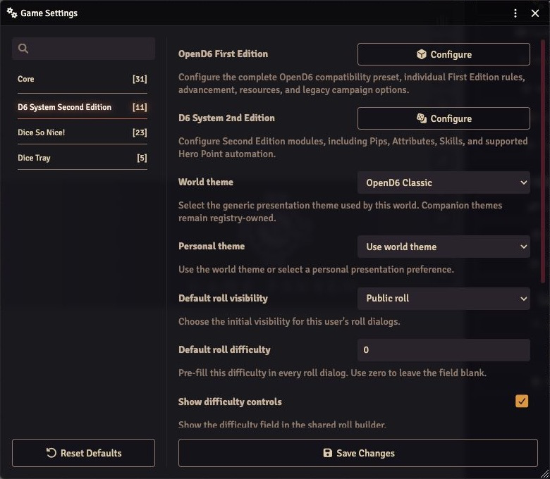

### Create an Actor

Open the **Actors** sidebar and select **Create Actor**. The supported Actor
families currently include Character, NPC, Creature, Vehicle, and Starship.
Character is the complete player-facing vertical slice. NPC and Creature use
the character foundation, while Vehicle and Starship have dedicated
Second Edition sheets.

New native Second Edition Characters enter the character-creation workflow.
Existing or imported Actors do not enter creation automatically.

### The default character sheet

The sheet uses the OpenD6 Classic charcoal-and-gold theme and the same task
structure as OpenD6 Next. Its main workspaces are:

- **Attributes & Skills**
- **Biography**
- **Traits & Equipment**
- **Combat**

When the Gamemaster pauses the world, the system presents a stationary
charcoal-and-antique-gold D6 cube on a finished plinth. Two thin orbital rings
move independently behind its transparent cutout, with restrained violet nodes
and illumination.
The cube never spins as a flat image. Reduced-motion preferences stop the orbit
and breathing illumination while retaining the complete pause presentation.
Selected companion themes may provide their own owner-scoped pause artwork;
the system validates the asset path and safely falls back to the built-in cube.

The header shows the active edition presentation, rules-owned resources, and
the current Condition. Its diffuse background wordmark follows the resolved
rules profile live: **D62e** for native Second Edition and custom profiles, or
**OPEN D6** for the complete Open D6 First Edition profile. Move the pointer over
the portrait—or focus it with the keyboard—to reveal the OpenD6 animated scan,
glow, reticle, camera, and **Edit** treatment. Owners and Gamemasters can
activate the portrait to open Foundry's native Image Browser and choose a new
image. The same artwork control is available on Vehicle, Starship, and owned
Item sheets; browsing files still follows the Foundry role permissions
configured by the Gamemaster.

## 2. Game System Mode and Rules

### Read the campaign in this order

When reviewing a world, answer these questions from top to bottom:

1. Which **Game System Mode** supplies the baseline rules?
2. Which rules components from that edition are active?
3. Which cross-edition substitutions or extensions modify the baseline?
4. Are all prerequisites satisfied?
5. Does the capability matrix show any partial, planned, or unresolved behavior?

This order prevents one borrowed rule from being mistaken for an edition
change. For example, allowing a D6 System Second Edition Advanced Skill in an
Open D6 First Edition campaign is an explicit extension; it does not turn the
campaign into D6 System Second Edition.

### Native Second Edition

Core Second Edition uses Agility, Brawn, Knowledge, and Perception. Optional
Attributes and Skill modules are selected in the Second Edition configuration.
The resolved campaign profile is the single source used by new Actors, sheet
presentation, Skill synchronization, Item selectors, rolls, and the public API.

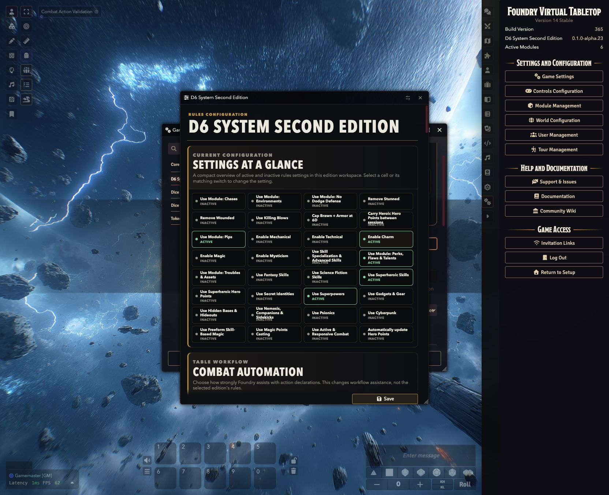

Core Second Edition uses whole-die Attribute and Skill progression. Enable
**Module: Pips** to use `+1` and `+2` steps, split dice during creation, and
sequential pip advancement. See D62e pp. 94–95.

### Open D6 First Edition compatibility

Select **Open D6 First Edition** under **Game System Mode** to activate the complete
compatibility baseline. It synchronizes the supported First Edition behaviors,
including:

- meets-or-beats difficulty evaluation;
- the active genre's initiative Attribute rolls in the Combat Tracker;
- the classic Wild Die-one strategy;
- Character Points and Fate Points;
- Character Point advancement;
- classic pip progression; and
- the OpenD6 Attribute profile.

Individual edition behaviors may be changed after choosing the baseline. Any
such change produces an explicit custom profile rather than silently changing
Game System Mode. Edition-owned world controls appear only in their dedicated
workspaces; they are no longer duplicated in Foundry's root settings list.
Foundry restricts these world settings to the Gamemaster; players retain only
their personal theme and default roll visibility controls.

The compatibility baseline supplies shared First Edition mechanics; it is not a
complete Adventure, Fantasy, or Space content library by itself. At the top of
the **Open D6 First Edition** settings, **Campaign package** lists genre modules
that are installed and enabled in Foundry. Choose one genre package to activate
its rules and compendiums for this world, then optionally choose a compatible
setting companion. Enabling a module only makes it available—Foundry module
load order never selects campaign rules.

If no genre package is installed, choose **None — shared First Edition rules
only**. Characters and the shared 60-Skill pack remain usable, while genre
equipment, creatures, templates, powers, vehicles, and starships are absent. If
a previously selected module is disabled, the settings preserve its ID and show
an **Unavailable** warning so the Gamemaster can restore it or deliberately
choose another package.

The separately installable **Open D6 Space** and **Open D6 Fantasy** Foundry
modules provide genre-specific profiles and compendiums. Enable the one you
want under **Manage Modules**, then return to **Open D6 First Edition → Campaign
package** and select **Open D6 Space** or **Open D6 Fantasy**. Availability does
not activate it automatically. Space's public content is
drawn from the Open Game Content on OD6 printed pp. 15–120 and 126–137 and uses
short original guidance plus printed-page citations instead of source prose or
art.

Fantasy changes the active sheet to Agility, Coordination, Physique, Intellect,
Acumen, Charisma, and Extranormal. It seeds the 54 Fantasy Skills, uses Acumen
for First Edition initiative and Physique for Strength-based system operations,
and supplies four compendiums: Skills, Equipment, Generic Characters and
Animals, and Character Templates. Public records contain mechanical facts,
original concise guidance, and printed-page references only.

The separately installable **Echo D6 Companion** is a setting companion for
**Open D6 Space**. Enable both modules, select **Open D6 Space** as the genre,
then select **Echo D6** as the companion. Echo terminology and sheet-logo
branding activate only after that selection; merely enabling the module does
not change the world. The optional **Echo D6** visual theme remains a separate
theme choice; when selected, it replaces only the D6 cube inside the existing
animated paused-game rings with the Echo logo. A GM may use **Configure
Settings → Module Settings → Apply Echo
Recommended Rules** to apply the system's public Open D6 preset. That explicit
action changes rules settings, but it does not select the genre, companion, or
theme.

When Echo is the valid selected companion, existing system fields use Echo's
vocabulary: **Echo Points**, **Credits**, **Faction Allegiance**, **Hull
Toughness**, **Shielding / Hull**, **Slipstream Drive**, **Echo Resonance**,
**Resonance**, **Echo Powers**, **Harmonize**, **Attune**, and **Project**.
Credits appear with the other character resources, Faction Allegiance appears
in Biography, and Slipstream Drive appears on Starships. These are ordinary
system-owned fields and survive disabling or changing the companion; only their
labels are selected presentation. Re-selecting Echo restores the Echo labels.

In the Compendium Packs sidebar, open **Setting Companions → Echo D6**. The
legacy Echo companion contained no content catalogs to convert. Empty Echo pack
shells are supplied for
**Characters**, **Character Templates**, **Equipment**, **Powers**, and
**Vehicles & Starships** so the setting can be built out manually. A GM may
right-click a shell, choose **Configure Compendium**, unlock it while adding
world content, and lock it again afterward. Module updates may replace bundled
pack data, so finished additions should later be moved into the module's
source-backed catalog and deterministic build.

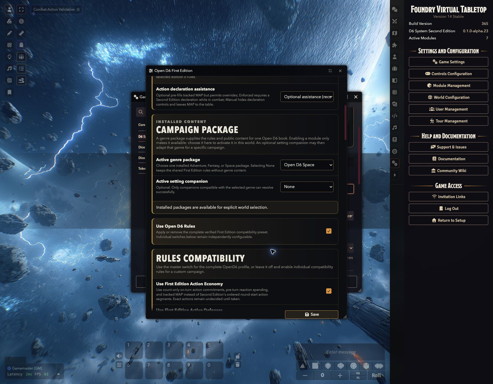

First Edition flexible action allotment has a rules-isolated commitment model,
typed active defenses, and an independent relative-movement planner. The roll
builder can also apply MAP manually, including reaction rolls. First Edition
resistance and the Space wound-level strategy are independent of the Second
Edition Condition track. Incompatible Second Edition panels do not remain
active merely to fill a gap.

### Combat Tracker initiative

The GM chooses one native Second Edition initiative strategy under **Module:
Alternate Initiative**:

- **Standard** uses the relevant action roll. The tracker hides initiative-roll
  controls and lets the GM persist a practical order with drag or move buttons.
- **Simple** keeps the GM-set group order for the scene. Participants within a
  group act fluidly as the table decides.
- **Basic** lets each participant roll Perception through the normal D62e roll
  builder. The tracker labels declaration positions from lowest to highest and
  resolves from highest to lowest. Results clear for a fresh roll each round.
- **Narrative** uses the highest initial Perception result, then lets the current
  participant's owner or the GM choose who declares next. The chain persists on
  the Combat, and the previous last declarer starts the next round.

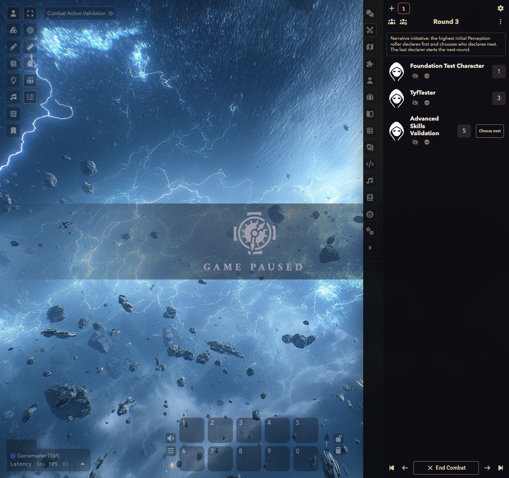

The printed rules do not define tied Perception results; ties retain the
Combat's prior stable order. The optional Hero Point interrupt in the Narrative
sidebar remains a GM decision and is not automated.

Enable **Use First Edition Initiative Rolls** to use the independent Open D6
tracker strategy instead. Each combatant rolls Perception, including its Wild
Die and pips, and Foundry sorts the results. The complete Open D6 preset enables
this option by default and it takes precedence over the selected native Second
Edition strategy.

### Custom profiles

A custom profile is supported, but the Gamemaster owns the resulting campaign
design. The capability matrix reports each rules family as active, preserved
but inactive, or planned. Review it after every rules-setting change.

### What players need to know

Players cannot change world rules, but they should know the active Game System Mode,
which optional rules components affect their character, which cross-edition
choices are active, and which workflows remain partial or planned. The
Gamemaster should share that summary at campaign creation and whenever the
profile changes. Edition changes never convert or delete inactive resources.

## 3. Character Sheet and Modes

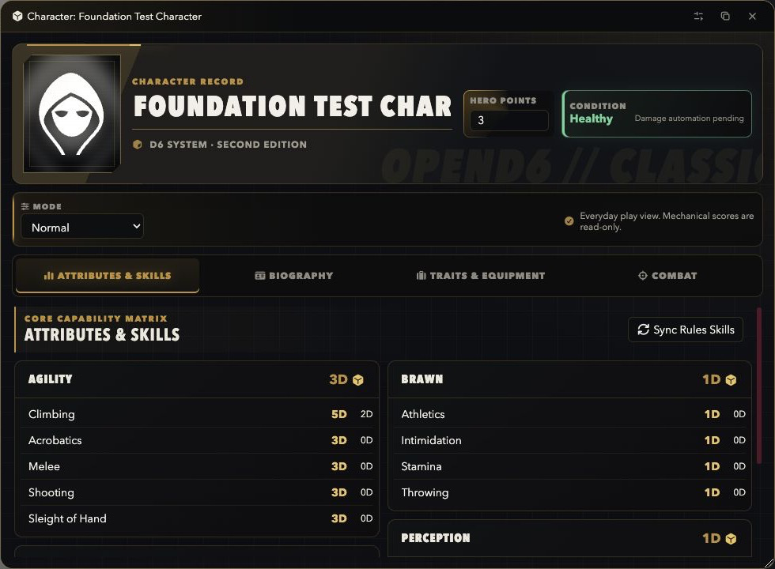

### Normal mode

Normal mode is the everyday play view. Mechanical Attribute and Skill scores
are read-only. Players roll by selecting an Attribute or Skill name/die code;
they cannot directly type pip values or create arbitrary mechanical entries.

Rules-owned resources may be changed only through the workflows and permissions
appropriate to that resource. A Gamemaster may make authorized corrections.

### Advance mode

Advance mode shows improvement actions for the campaign's selected advancement
strategy. It never becomes a hidden direct editor.

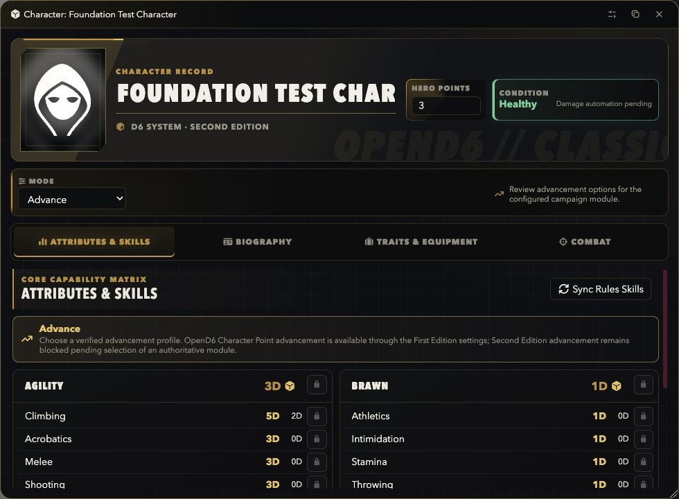

If the campaign has no automated advancement strategy selected, the controls
remain disabled and explain what the Gamemaster must configure. This is
intentional protection against spending an invented currency or applying the
wrong edition's costs.

### Free Edit mode

Free Edit is available only to a Gamemaster. It exposes canonical stored scores
and Item-management controls for setup, correction, migration review, and
testing. It is not a player advancement mechanism. Adding a custom Skill first
asks for its name; cancelling or closing that dialog creates nothing. Editable
Skill rows include a delete control with a separate confirmation step, so an
accidental custom Skill can be removed without editing world data directly.

### Sheet header controls

The three upper-right controls use Foundry's ApplicationV2 conventions:

- toggle additional window controls;
- copy the document UUID; and
- close the sheet.

UUIDs are useful for macros and integration testing. Modules should still use
the system's versioned public API rather than private sheet fields.

## 4. Character Creation

New native Second Edition Characters begin in a protected creation state. The
sheet displays remaining budgets, permitted increments, and validation results.

The implemented core audit follows D62e p. 20:

- 12D Attribute budget;
- 1D minimum and 5D creation maximum per Attribute;
- 7D Skill budget;
- 2D creation maximum per Skill; and
- explicit additions for configured optional Skill modules.

Creation controls prohibit spending beyond the current Attribute or Skill
budget. An increase that cannot fit is disabled in the sheet and rejected by
the protected creation service.

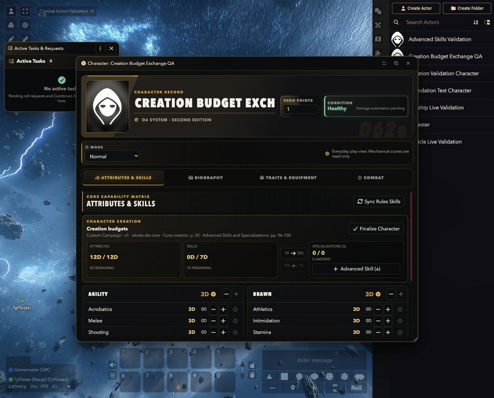

### Character Templates

During creation, **Preview & Apply** lists templates supplied by the system and
enabled, lawfully supplied Foundry modules. The base system includes the four
Fantasy templates from D62e pp. 168–171: **Occultist**, **Priest**, **Warrior**,
and **Wizard**. The preview shows every Attribute replacement, suggested
Skill, equipment Item addition, starting Superpower, source citation, and any
reason the template is incompatible with the current campaign.

Applying a template sets its Attribute allocation and records its provenance.
Suggested Skills are guidance only: the template never spends any of the
character's Skill dice. A template may add registered Armor, Gear, or Weapons,
but cannot change Hero Points, advancement resources, Conditions, or arbitrary
character data. Only an owning player or Gamemaster may apply one, only while
creation is active, and only one template may be applied to a character.

You can apply a template in either of two ways: use **Preview & Apply** during
creation, or open its compendium and drag the Character Template entry anywhere
onto the character sheet. A compendium drop opens the same exact preview and
confirmation before changing the character; it does not bypass creation,
ownership, budget, or compatibility checks. Templates are explicitly marked for
**D6 System Second Edition** or **Open D6 First Edition**. If the current game
mode does not match, Foundry explains the mismatch instead of partially applying
the template. The separately activatable Second Edition Fantasy module supplies
the four Second Edition Fantasy templates. A lawful genre or companion module
may supply First Edition templates through the same protected workflow.

The Fantasy templates use the optional Charm, Magic, and Mysticism Attributes,
so enable the Attributes required by the chosen template before creating the
character. Their listed Skills also rely on the appropriate Fantasy or magic
Skill options. The printed introduction recommends 10D for Skills; the system
leaves those dice for the player to assign instead of silently spending them.
The Priest's printed Attribute list totals 18D even though the introduction
states that every template uses 21D. Its preview therefore preserves every
listed score exactly and clearly shows **3D Attribute dice left to assign**.
This avoids inventing which Attribute the missing dice should increase.

The **D6 System: Second Edition Fantasy Templates** compendium is a quick
reference for all four profiles. Apply one from **Preview & Apply** or drag its
compendium entry onto a new Character with creation still active.

A lawful **Superheroic Template** is stricter. Before it can be applied, the
campaign must have Charm for a 15D Attribute budget, the Superheroic Skills
package for an 8D assignable Skill budget, and Superpowers at the 10D campaign
level. The character cannot already have Superpowers allocated. The preview
lists every contributed power with its rank and cost and requires their total
to be exactly 10D. Applying the template creates those Talent Items together
with any equipment; if any final write fails, Foundry removes every Item that
attempt created. The public system supplies this workflow but not the four
named templates, their power lists, prose, examples, or art.

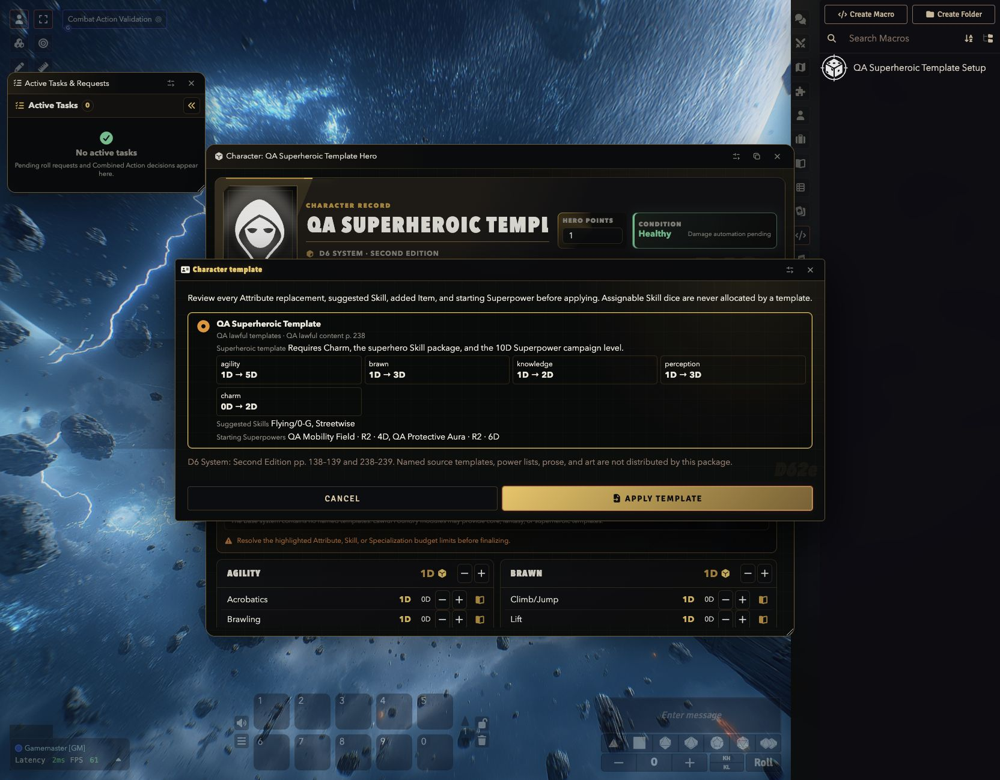

Without Module: Pips, creation controls move in whole dice. With the module,
they move in pips and enforce the printed split-die limits from D62e pp. 94–95.

Select **Finalize Character** only after the audit is valid. Finalization ends
the protected creation workflow and cannot be used as an ordinary editing
toggle.

### Advanced Skills and Specializations

When **Skill Specialization & Advanced Skills** is enabled:

- the creation panel begins at **Skills 0D / 7D** and
  **Specializations 0 / 0**;
- use the right-arrow exchange control to convert 1D of unspent Skill budget
  into three Specialization slots, changing the capacities to
  **Skills 0D / 6D** and **Specializations 0 / 3**;
- the reverse control returns three wholly unspent slots to recover that 1D.
  Created Specializations must be deleted before the conversion can be undone;
- Specializations display `(s)` and Advanced Skills display `(a)` beside their
  names;
- **Advanced Skill (a)** in the Specializations budget card opens one atomic
  definition dialog for the Advanced Skill's name and all connected standard
  Skills;
- at least two connected Skills must be checked before the Advanced Skill can be
  created, and cancelling the dialog creates nothing;
- its Item sheet presents the same named checkbox list when those connections
  need to be reviewed or changed later;
- the Advanced Skill appears as a linked `(a)` row beneath every connected
  Skill instead of belonging visually to one Attribute;
- every prerequisite must have its own rating of at least 3D, excluding its
  Attribute, and the Advanced Skill cannot exceed the lowest prerequisite;
- clicking the linked row rolls the parent Skill with that Advanced Skill
  preselected as context, while its small die button rolls the Advanced Skill's
  own rating directly; and
- creating a Specialization asks for its narrow name, such as **Parkour**, links
  it to the parent **Acrobatics** Skill, and supplies its fixed +1D bonus.

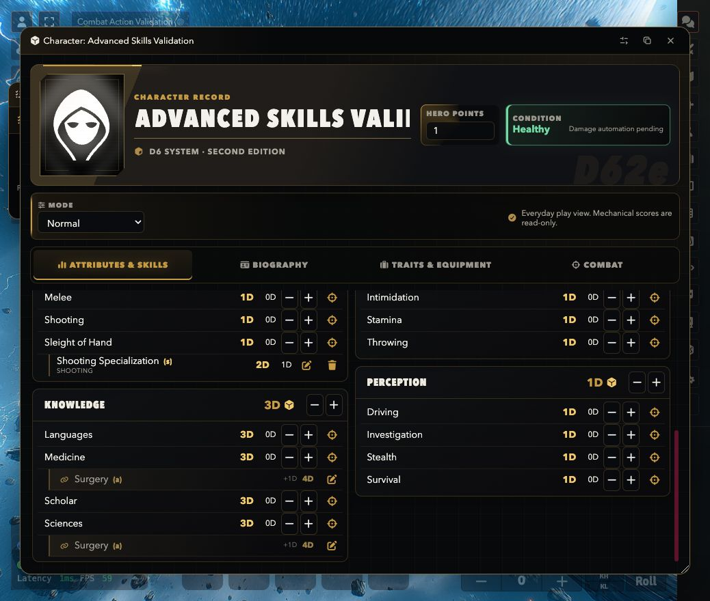

The explicit 1D-for-three exchange follows D62e p. 99. The broader creation and
roll behavior is sourced to D62e pp. 96–100. Advanced Skills
are preserved but inactive in complete Open D6 First Edition mode unless the Gamemaster
explicitly enables the Second Edition extension.

### Fantasy Skills and Freeform Skill-Based Magic

The Gamemaster may enable **Fantasy Skills** independently. It adds Riding,
Lockpicking, Swimming, Barter, Navigation, Traps, Gambling, and Streetwise;
Languages keeps its existing core identity. The rulebook recommends adding 1D
to the creation Skill budget for every three included Fantasy Skills. The
system displays that guidance but leaves the actual additional-Skill budget
under explicit GM control.

### Science Fiction Skills

The Gamemaster may enable **Science Fiction Skills** independently. Synchronized
characters retain core Languages and gain Flying/0-G, Barter, Gambling,
Gunnery, and Streetwise. The setting does not enable Mechanical or Technical;
those remain separate Additional Attributes. As with other optional Skill
packages, the printed recommendation of +1D creation Skills for every three
added Skills remains an explicit GM budget choice.

On the Combat tab, Flying/0-G shows its complete Die Code, guideline movement
in meters per round, guideline hover duration in rounds without a test, and its
usual one-action cost. An owner may choose either normal Perception or the
complete Flying/0-G Die Code as Dodge's basis. Flying already contains Agility,
so the defense calculation never adds Agility twice. See D62e pp. 173–176.

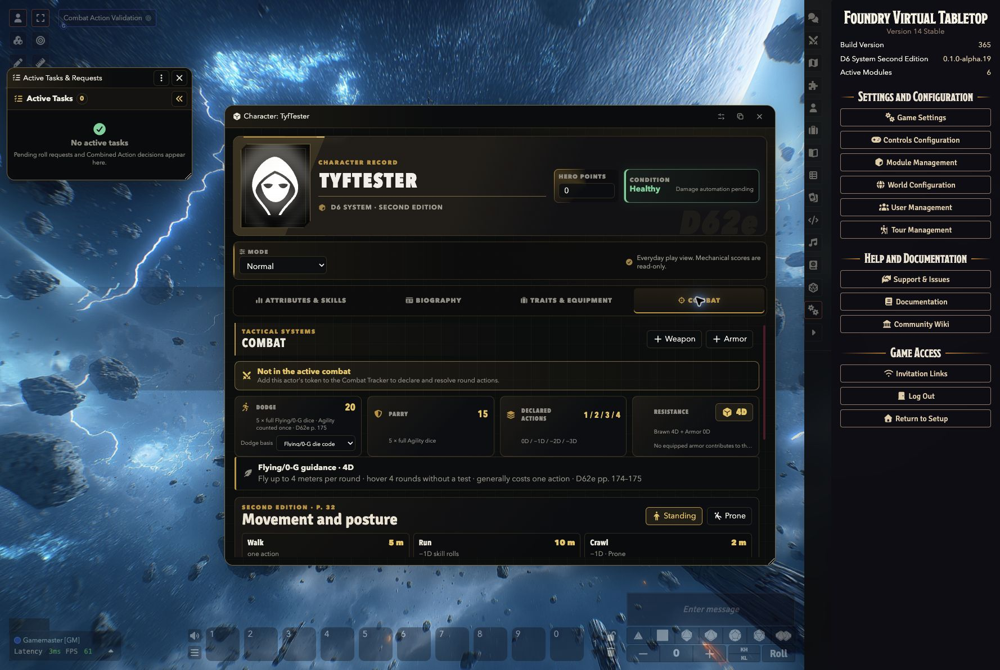

**Freeform Skill-Based Magic** requires all three of these settings:

- Additional Attribute: Magic;
- Skill Specializations & Advanced Skills; and
- Freeform Skill-Based Magic.

The active catalog supplies Arcane World, Craft Magic Item, Identify Magic, and
Spell School. Spell School uses Change (Alteration), Movement (Apportation),
Creation (Conjuration), and Knowledge (Divination) specializations.

Create a **Manifestation** from **Traits & Equipment**, then choose its Spell
School, Power, target, resistance, duration, casting time, and range. Each
change is saved immediately and the sheet recalculates the printed Difficulty.
The final value cannot be lower than 5. The example below is Power 3, two or
three targets, partial resistance, one-round duration, one-action casting, and
senses range: `5 + 10 + 5 + 5 + 0 + 0 + 5 = 30`.

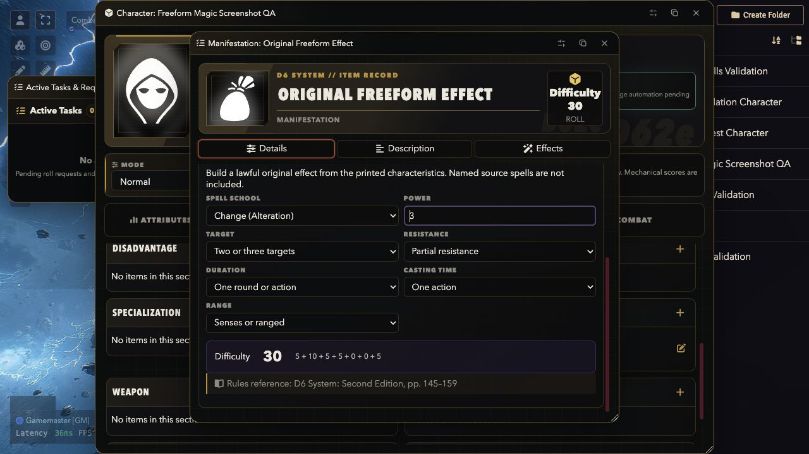

Select **Roll** on the Manifestation to use the normal protected roll builder.
A matching Spell School specialization has no untrained penalty. Magic or Spell
School dice without the specialization add +5 Difficulty; an attempt with no
Magic or Spell School dice uses the system's minimum 1D roll and adds +10.
Chat records the school, Power, penalty, final Difficulty, and pp. 145–159
reference. The rules can describe arbitrary original effects, so the system
does not invent or automatically apply their fictional consequences.

## 5. Rolls, Wild Die, and Chat Cards

Select an Attribute, Skill, Specialization, weapon Attack, weapon Damage, or
resistance control to use the shared typed roll pipeline. Sheets, Items, future
HUD adapters, and macros should all delegate to this same service.

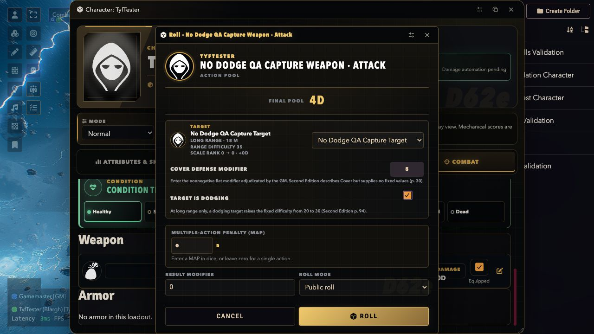

### Roll builder

The roll builder can present:

- the final effective Die Code;
- Hero Point spending when applicable;
- an optional difficulty;
- a flat result modifier;
- public, private-GM, blind-GM, or self-only visibility;
- an opposed completed score;
- participant types and tie information;
- valid Advanced Skill task context; and
- the current multiple-action penalty; and
- a GM-adjudicated Cover defense modifier on targeted Second Edition ranged
  attacks.

The Gamemaster can hide difficulty, modifier, or opposed-roll controls in the
root system settings.

### Difficulty and opposed checks

Native Second Edition succeeds only when the total exceeds the difficulty
(D62e p. 26). Complete Open D6 First Edition succeeds when the total meets or
exceeds it (OD6 pp. 6, 59).

Opposed checks compare completed scores. The implemented tie order is sourced
to D62e p. 25. When the rule still requires table judgment, the result remains
explicitly unresolved instead of inventing a winner.

### Wild Die

Native Second Edition uses the Advantage and Complication workflow from D62e
pp. 26–27. The system presents required choices and repeated explosions as
structured state. Complete Open D6 First Edition uses the verified classic
Wild Die-one strategy from OD6 pp. 55–56.

The Gamemaster can instead select one of the mutually exclusive **Alternate
Wild Die** strategies in the Second Edition settings:

- **Basic** (p. 71): sixes explode; an initial 1 removes the Wild Die and the
  highest ordinary die automatically.
- **Classic** (p. 72): sixes explode; an initial 1 asks the Gamemaster to classify
  a penalty or narrative Complication. A penalty removes the same two dice; a
  Complication ignores the Wild Die and leaves its narrative consequence to the
  table.
- **Simple** (p. 73): sixes explode and every other face counts normally.

Every chat card names and cites the active strategy. Removed dice are struck
through, and the typed chat flag retains the exact policy. Selecting any of
these options does not alter the independent OpenD6 Wild Die strategy.

Select **Configure** for **D6 System Second Edition** in the Gamemaster's world
settings, then choose the campaign's Wild Die strategy.

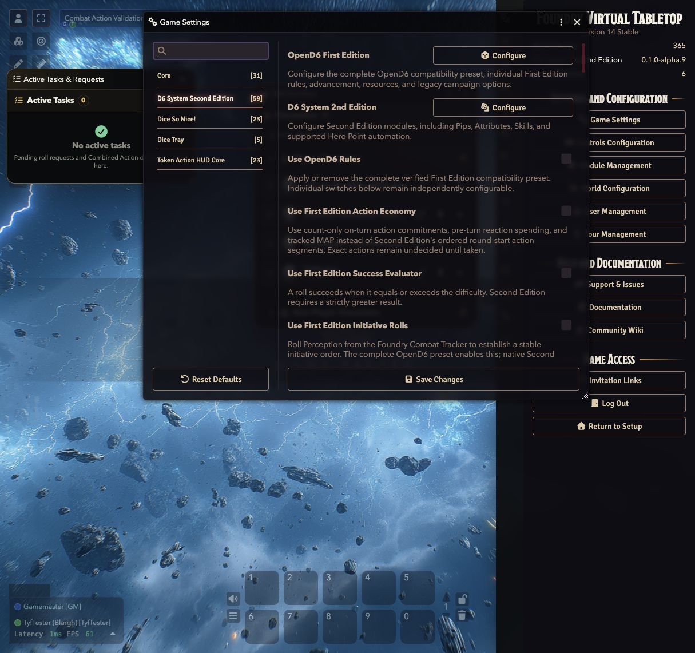

Player-owned choices remain on the rolling client. When a successful native
Second Edition roll produces a Wild Die 1, the player waits while an active
Gamemaster receives the same themed **Partial / Failure** decision window. The
roll continues only with that GM response. If no Gamemaster is online, the
system reports that the decision is unavailable and does not silently choose an
outcome.

If a player's blind roll produces an Advantage choice, the active Gamemaster
makes the **Exceptional / Ordinary** decision because only the Gamemaster can
see the hidden result. The player receives neither the total nor the choice
window. Private-GM and self rolls remain player-owned because the rolling player
can see those results. If no Gamemaster is online, the blind roll stops without
an automatic choice or resource change.

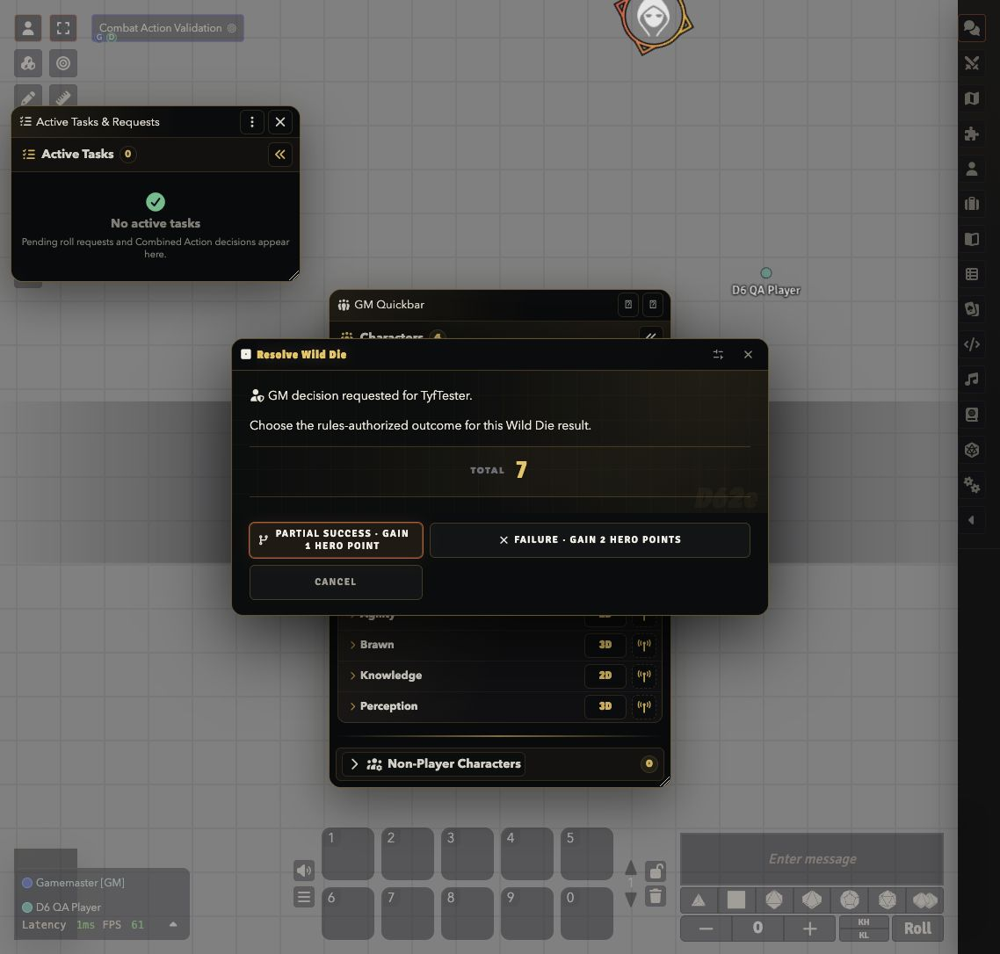

An unopposed roll without a difficulty can report an Advantage or Complication,
but it cannot infer whether the underlying action succeeded.

Private rolls are whispered to the rolling user and every Gamemaster. Blind
rolls are visible only to Gamemasters, while self rolls are visible only to the
rolling user. The system requires a current user recipient for private and self
rolls instead of risking an empty-recipient message.

### Hero Points

The GM selects one mutually exclusive Hero Point strategy in **Module: Hero
Points** (D62e pp. 75-76):

- **Heroic** is the default core behavior. One point doubles the complete Die
  Code before a roll, rerolls an eligible failed evaluated roll, or prevents a
  proposed transition to Stunned. At a new session the GM may restore every
  personal Actor to the configured starting balance unless carry-over is on.
- **Basic** spends any number of points before a roll. Each point adds one
  ordinary bonus die; these dice are not Wild Dice.
- **Classic** uses Experience Points as the Hero Point balance. It requires the
  Classic Wild Die and Experience Point advancement. Before the GM announces
  the result, the roller may spend up to the baseline Attribute's whole-die
  rating; every point adds one independently resolving Wild Die, and every 6
  rolled on a Classic Wild Die awards one point.

Trouble, Asset, and supported outcome awards always use the balance selected by
the active strategy. Killing Blow survival does the same. Failed-roll rerolls
and Stunned prevention remain Heroic-only. All automatic changes use
owner-checked transactions; automatic bookkeeping can still be disabled for
manual campaigns. Superheroic Hero Points are a separate deferred p. 204
module.

### Doubling Down

Eligible failed, non-combat Attribute and Skill rolls offer **Double Down**.
The retry preserves the effective Die Code and requires narration. It is
single-use and mutually exclusive with the failed-roll Hero Point reroll. See
D62e p. 25.

The first eligible owner to activate either follow-up obtains a
Gamemaster-authorized claim on the original chat card. This prevents two
connected owners from rerolling the same result or spending the same opportunity
twice. Cancelling or failing the follow-up releases the claim; a completed
follow-up disables both alternatives for everyone.

### Chat cards

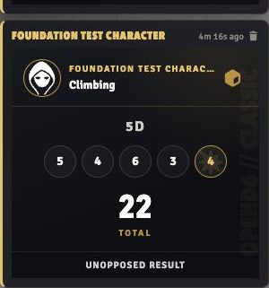

Chat cards retain the typed result in system flags; they never parse visible
prose to reconstruct rules state. Their visual language is:

- cube: generic roll result;
- burst: Wild Die or exceptional outcome;
- lightning bolt: Hero Point expenditure or award;
- graduation cap: Advanced Skill context;
- stacked layers: action-economy context; and
- circular arrows: reroll or Doubling Down.

Older messages retain the HTML and icons rendered by the system version that
created them.

### Dice So Nice

Dice So Nice is optional. When present, the system registers a dedicated
`dw` Wild Die preset using the OpenD6 Classic black-and-gold presentation.
The Wild Die is therefore physically distinct from every standard die while
remaining part of the same typed roll result. Dice appearance never changes the
Wild Die rules or numerical resolution.

System rolls explicitly select the Second Edition dice system, colorset, and
Amiri face font without changing the player's saved global Dice So Nice
preferences. This prevents a previously saved custom color from overriding the
system presentation. Every standard denomination (`d2`, `d4`, `d6`, `d8`,
`d10`, `d12`, `d20`, `d100`, and Fate dice) uses the interface theme's
antique-gold body, bright-gold edge, and near-black numerals. The custom `dw`
Wild Die remains the only black die.

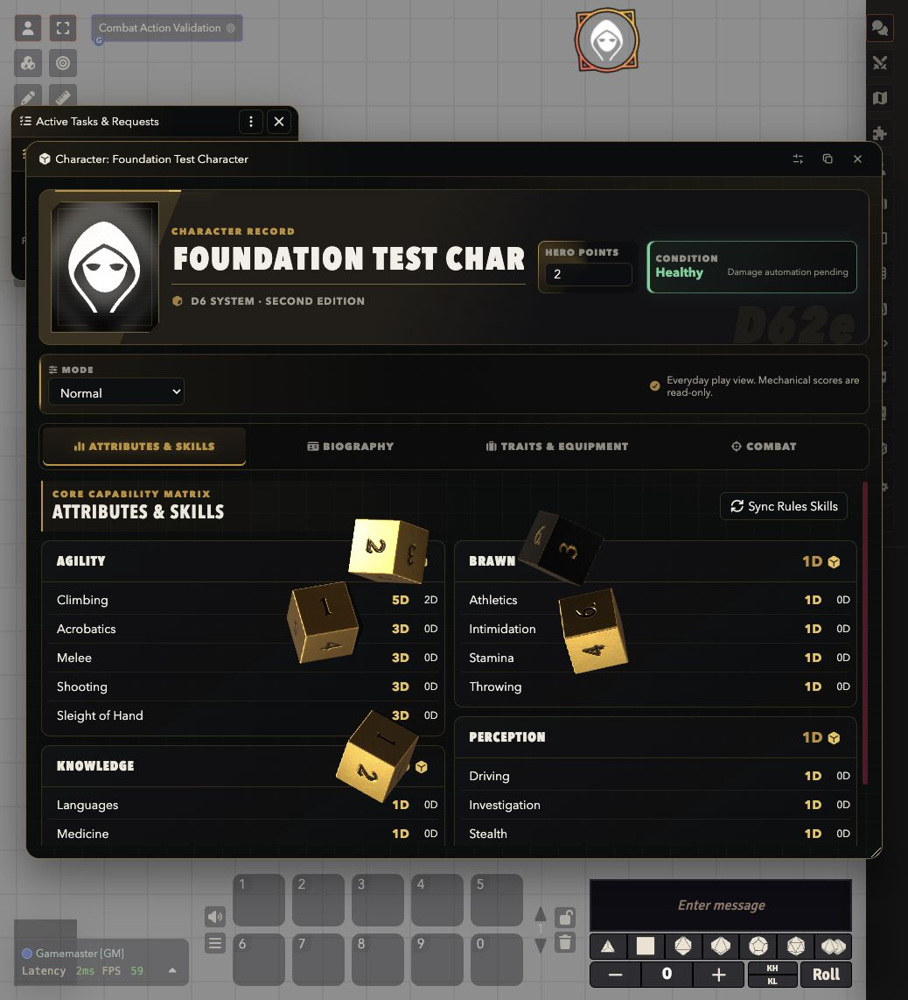

## 6. Advancement

Select **Advance** on the character sheet. The available workflow depends on
the resolved advancement capability.

### Second Edition Experience Points

When **Experience Points** is selected, Attribute, standard Skill, and Advanced
Skill improvements use protected Experience Point transactions. Costs and
prerequisite validation follow D62e pp. 86–88 and p. 97.

Core progression purchases a whole die. Module: Pips instead requires the
sequential `+1`, `+2`, then next-die progression described on D62e pp. 94–95.
A Gamemaster can award or correct Experience Points from the header; players
spend them only through Advance mode.

An Advanced Skill's linked `(a)` row carries its own advancement control under
every connected Skill. Its Experience Point cost is twice the cost of a regular
Skill at the same rating. The confirmation dialog shows that cost before
anything is spent. If the next rating would exceed the lowest connected
prerequisite Skill—or the prerequisites do not each have at least 3D of their
own rating—the control is locked and explains the prerequisite limit. A rejected
purchase changes neither Experience Points nor the Advanced Skill rating
(D62e p. 97).

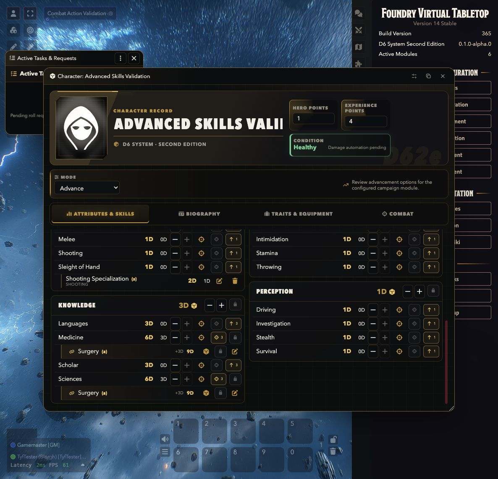

In **Free Edit**, the same linked row exposes the Advanced Skill's compact pip
score field. Editing either repeated reference updates the one shared Advanced
Skill Item and every linked presentation. This is the GM correction route;
ordinary players still spend advancement resources only through Advance mode.

Specializations do not receive repeated Experience Point improvements. When
**Module: Skill Specializations & Advanced Skills** is enabled, each standard
Skill row in Advance mode instead offers **Acquire specialization**. Enter the
narrow focus in the dialog and confirm the displayed Experience Point cost.
The cost is the Skill's own rating plus the number of specializations already
linked to that Skill. A Skill cannot have more specializations than its rating,
Advanced Skills cannot receive them, and every acquired specialization remains
a fixed +1D bonus (D62e p. 99).

### Second Edition Milestones

When **Milestone Advancement** is selected, Advance mode shows the character's
unused milestone rewards. The Gamemaster's **Award milestone** action grants
exactly +1 Attribute die and +3 Skill dice. Internally the Skill award is stored
as nine pips so whole-die campaigns spend three at a time while Module: Pips
campaigns may spend them one at a time. Attribute rewards always increase one
Attribute by +1D (D62e pp. 90–91).

If **Perks, Flaws & Talents** is active, a complete unused bundle can instead be
exchanged for a new Perk at R1 or one additional rank on an existing Perk. The
transaction requires and consumes one Attribute die plus all nine Skill pips;
partial balances cannot be exchanged.

### Second Edition Narrative arcs

When **Narrative Advancement** is selected, an owning player can propose an arc
from the Advance workspace. Choose its Skill or Attribute reward, give the arc
a title, and enter one story step per line. The dialog displays the current and
new reward rating and required step count. The system enforces steps equal to
the reward's new die rating; Skills are the rulebook's recommended reward.
When **Perks, Flaws & Talents** is active, the same dialog can propose a new R1
Perk or the next rank of an existing Perk. That arc requires steps equal to the
Perk's new rank. Narrative Flaw and Talent rewards remain deliberately absent,
matching the rulebook's recommendation.

The Gamemaster approves a draft before its steps can be checked. Once every
approved step is complete, only the Gamemaster can grant the +1D or Perk reward.
If an existing target rating changed after approval, the stale arc is rejected
rather than granting an ambiguous increase. Draft, approved, and completed arcs
persist on the Actor (D62e pp. 92–93).

### OpenD6 Character Points

In the Open D6 First Edition advancement strategy, Advance mode calculates Character Point
costs and affordability for Attributes, Skills, and Specializations. Purchases
are owner-checked, deduct the resource transactionally, and roll back a failed
embedded-Item update. See OD6 pp. 52–54.

Changing edition strategies never converts Experience Points into Character
Points or deletes either stored balance.

## 7. Traits, Equipment, and Item Sheets

The **Traits & Equipment** tab groups embedded Items by player task rather than
raw database type. Current typed Item families include:

- Skills and Specializations;
- native Second Edition Perks, Flaws, Talents, Troubles, and Assets;
- Advantages and Disadvantages;
- Special Abilities;
- Weapons, Armor, and Gear;
- Actions and manifestations;
- character and species templates;
- cybernetics;
- vehicles, vehicle gear, and starship gear/weapons; and
- compatibility-oriented Item groups.

Inventory rows follow the same compact loadout pattern as OpenD6 Next. Each row
opens the embedded Item for inspection and editing. Equipment rows show their
quantity and an **Equipped** checkbox directly on the character sheet, so an
owning player can change the active loadout in Normal or Advance mode. The
per-group **Add** button is the keyboard-accessible alternative for creating a
new embedded Item; deletion remains a confirmed Free Edit operation.

The Second Edition settings application also offers one **Equipment era**
choice: Unclassified, Medieval, Modern, or Science Fiction (pp. 79-85). Newly
created equipment inherits the current selection. Inventory rows and Item
sheets display that classification; a different-era Item receives a visible
warning but is never hidden or deleted. A Gamemaster may reclassify an Item in
Free Edit. The base system includes the mechanically distributable equipment
from D62e pp. 79–85 in the **D6 System: Second Edition Equipment** compendium.
It uses concise original summaries and page references rather than reproducing
rulebook prose, examples, layout, prices, or art. Licensed Foundry modules can
supply additional validated catalogs, while custom Items remain clearly marked
as having no catalog provenance.

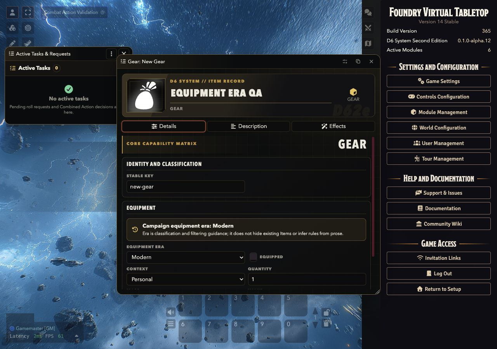

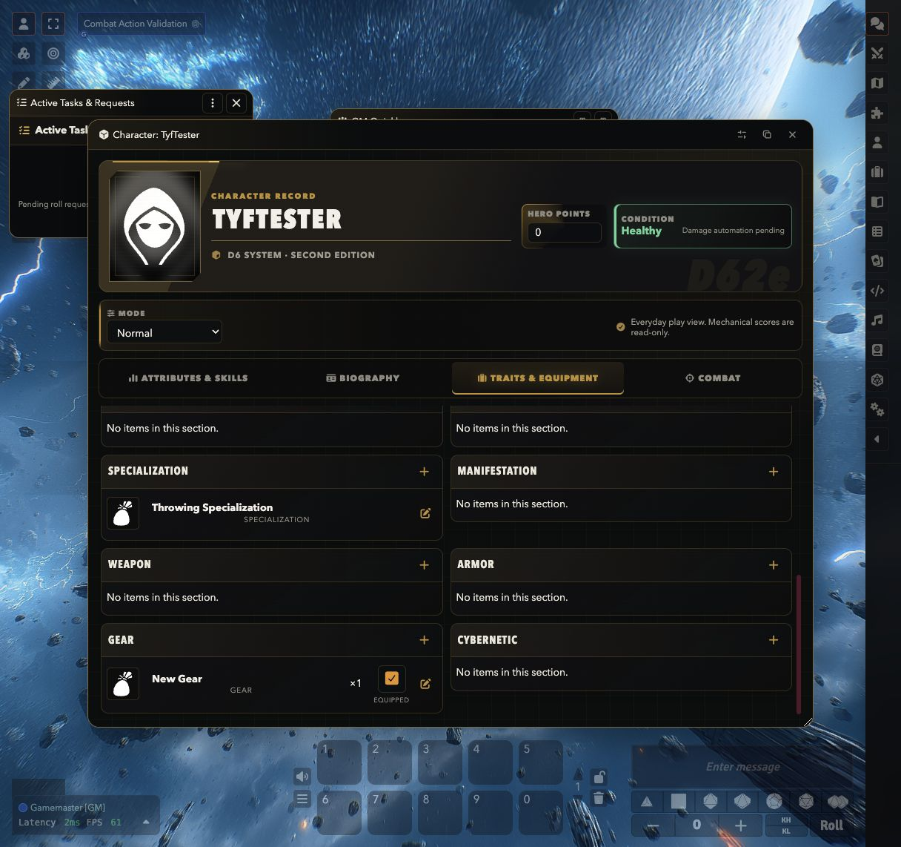

The canonical ApplicationV2 Item sheet shows only fields supported by the
Item's type. A Skill Item displays its Attribute, rating, training type, source
citation, and prerequisite/parent relationships where applicable. Advanced
Skills and Specializations have explicit, required name fields. A
Specialization's description is optional supporting detail and never replaces
its narrow focus name.

Every Item sheet has three shared workspaces:

- **Details** contains the type-specific mechanical and source fields.
- **Description** keeps narrative notes separate from configuration.
- **Effects** lists Foundry Active Effects attached to the Item.

Owners may edit an Item's narrative **Description** without gaining access to
its protected mechanical fields. They can also review the names and enabled
state of existing effects. Because a native Active Effect form can alter
document data, only a Gamemaster using **Free Edit** can open, create, or delete
effect documents. Deletion always asks for confirmation.

Owned Skills and Specializations can therefore be opened in Normal and Advance
mode for description editing and inspection. Their names, ratings, parent
relationships, and other protected fields remain disabled until the applicable
creation or Gamemaster Free Edit authority is active.

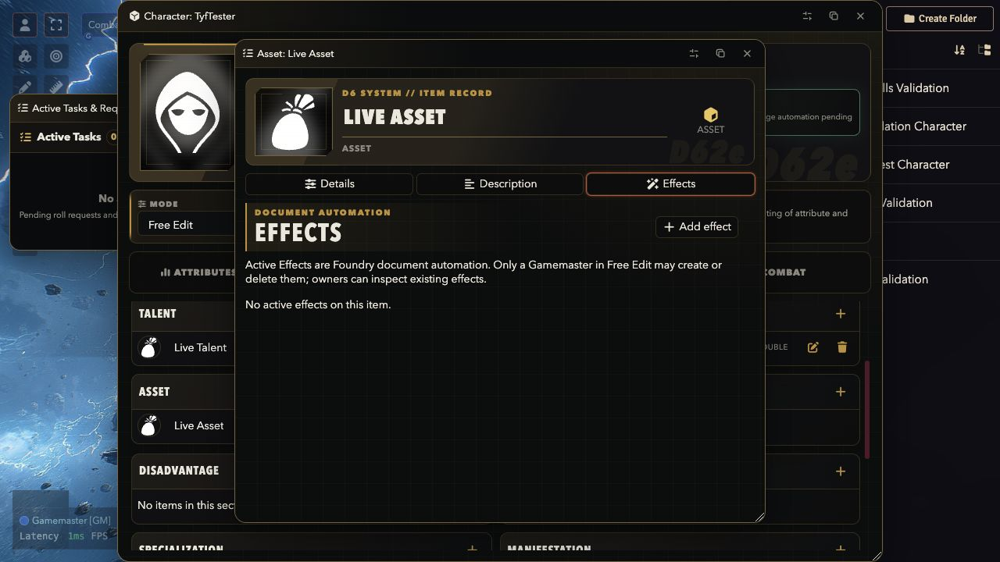

Native Second Edition feature Items follow D62e pp. 101-131:

- Perks and Flaws record rank plus a campaign-defined focus or scope.
- Talents also record their printed creation cost in Skill dice and whether the
  Talent may be purchased repeatedly.
- Troubles and Assets record the narrative trigger the player may invoke.

Enable **Module: Perks, Flaws & Talents** to include these Items in the Skill
creation budget. Perks cost one Skill die per rank, Flaws grant one Skill die per
rank, and Talents use their stored total Skill-dice cost. When a lawful content
module supplies a ranked Talent, the system multiplies its per-rank definition
cost before storing the Item.

Licensed or private content modules can add named definitions through the public
feature catalog. The system validates rank limits, required focus, repeatability,
source, creation cost, and semantic mechanic records before an owning player or
GM adds the feature. The created Item retains its catalog and mechanic snapshot
even if that module is later disabled. The generic system ships an empty catalog
and therefore does not distribute protected names or descriptions.

Enable **Module: Troubles & Assets** to show invocation controls. Each Trouble
or Asset can be used twice per session. Trouble grants one Hero Point and posts
the immediate Complication requirement. Asset grants either one Hero Point or
+3D to the Attribute or Skill roll selected by the player. Only a GM can reset
the session counters. Existing OpenD6 Advantages, Disadvantages, and Special
Abilities remain separate and are never renamed automatically.

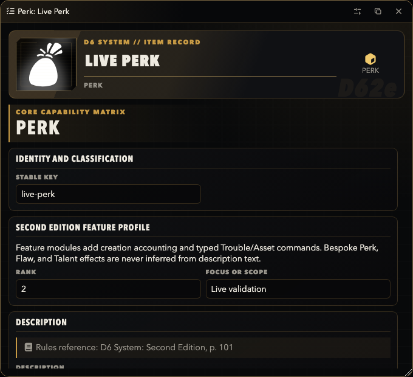

Descriptions are never interpreted as executable rules. Catalog mechanics are
closed typed data, not contributed code; narrative or context-dependent entries
remain explicit GM adjudication.

The public Skill packs intentionally contain stable IDs, names, Attribute
links, module IDs, and printed-page references—but no protected descriptive
prose. A private content companion may add descriptions without making the
generic system depend on private material.

### Adding reusable content to an Actor

Open **Compendium Packs**, open a suitable pack, and drag an entry anywhere
onto an owned Actor sheet. Foundry copies reusable compendium content; it does
not remove or edit the source entry. This workflow is available in both **D6
System Second Edition** and **Open D6 First Edition** modes.

- Characters, NPCs, and Creatures accept Armor, Gear, and Weapons.
- Vehicles accept Armor, Vehicle Gear, and Vehicle Weapons.
- Starships accept Armor, Starship Gear, and Starship Weapons.
- Characters, NPCs, and Creatures also accept compatible Skills,
  Specializations, feature and Power Items, manifestations, and cybernetics.
  The owning rules component must be active. A copied Skill starts at 0D so a
  compendium rating cannot grant free character improvement.
- A Second Edition Specialization drop uses the protected Character Creation
  or Advance workflow. It links to the matching parent Skill by stable key and
  applies the normal slot or Experience Point rules. In First Edition it is
  added at 0D and uses normal Character Point advancement.
- A cybernetic copy is always uninstalled. Its previous installer, linked
  Talent, and temporary combat-disable state are cleared; use the normal
  installation workflow on the receiving character.
- A Character Template opens its normal preview before applying. A species
  template may be applied once, clamps only Attributes outside its declared
  minimum/maximum ranges, and adds its required referenced Items as one
  rollback-safe operation.
- An Item bundle resolves each member by stable UUID. Required missing,
  incompatible, nested, duplicate, wrong-mode, or inactive content rejects the
  entire bundle instead of leaving a partly changed Actor.

The owning player or Gamemaster may perform the drop. An incompatible Item is
rejected with a clear message instead of being copied into the wrong inventory.
The per-group **Add** controls remain the keyboard-accessible route for creating
custom embedded Items.

Embedded inventory rows and Skill rows are also draggable. Drop an Item above
or below another Item of the same type on the same Actor to preserve a custom
order. Drop ordinary equipment or another safe, unprotected Item onto a
different owned Actor to move it. Foundry asks for confirmation, creates the
target copy first, and removes the source only after creation succeeds. If
source deletion fails, the target copy is rolled back. Skills,
Specializations, ranked features, templates, bundles, and installed
cybernetics are not transferable because moving them would bypass character
creation, advancement, species, or installation rules.

Gamemasters and lawful content modules can author species templates and Item
bundles from their Item sheets. Select the intended game mode and use stable
Item UUIDs for every included member. Species ranges are stored in pips (3
pips = 1D). Mark a member **Required** when the template must fail rather than
continue without it.

## 8. Combat and Conditions

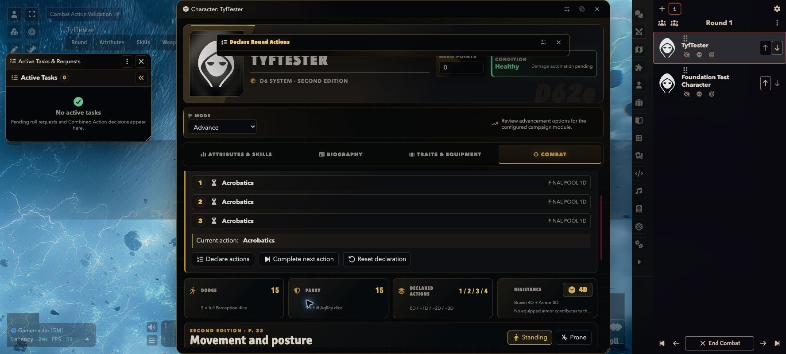

### Action economy assistance

The Gamemaster chooses **Action declaration assistance** in either restricted
edition-settings menu:

- **Optional assistance** (recommended) keeps the planner available, pre-fills
  its tracked MAP in the roll builder, and permits an explicit per-roll
  override.
- **Enforce Second Edition declarations** requires a declaration before an
  action roll by an active Second Edition Combatant.
- **Manual table workflow** hides the declaration workspace. Players tell the
  Gamemaster their actions and enter the agreed MAP directly in the roll
  builder.

This setting controls Foundry assistance, not the campaign's rules profile. The
roll builder's dedicated **Multiple-action penalty (MAP)** field is measured in
dice and remains available to both authorized players and the Gamemaster. A
manual override and a tracked declaration are distinguished in the chat audit.
No action roll may proceed if all applicable MAP, movement, and Condition
penalties leave fewer than 1D; pips do not rescue a zero-die pool.

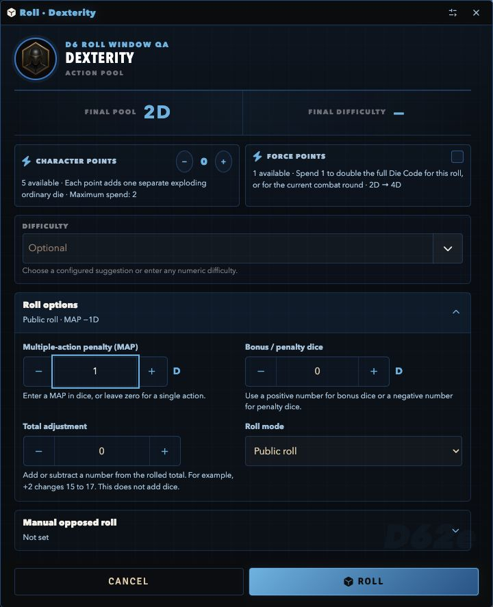

Native Second Edition Combatants declare an ordered list of actual Attributes,
Skills, weapon Attacks, movement, and GM-adjudicated non-roll actions. Each
listed roll source comes from the Actor rather than free text, so the dialog can
show its starting and projected final Die Code. The system stores versioned
Combatant state, applies one die of penalty for each declared action after the
first, and requires completion in order. See D62e pp. 29–31.

The dialog updates every final pool while actions are added or removed. A
declaration is prohibited when MAP, movement, or the current Condition would
reduce any selected pool below 1D. `0D+1` and `0D+2` remain zero whole dice and
are therefore prohibited. Staggered and Wounded each contribute their −1D;
Stunned, Incapacitated, Mortally Wounded, and Dead cannot declare or perform
actions. The same authoritative checks run again when the roll is attempted, so
a later Condition change cannot bypass the declaration limit.

If Damage makes a Combatant Wounded during the round, D62e p. 33 also ends that
character's participation for the rest of that round. The sheet marks every
uncompleted segment as forfeited, disables declaration and completion, and
blocks ordinary action rolls even when assistance is Optional or Manual.
Already-completed segments remain recorded. The Damage card and Token Action
HUD show the same forfeiture, and the next round clears it while retaining the
Wounded Condition and its normal -1D penalty.

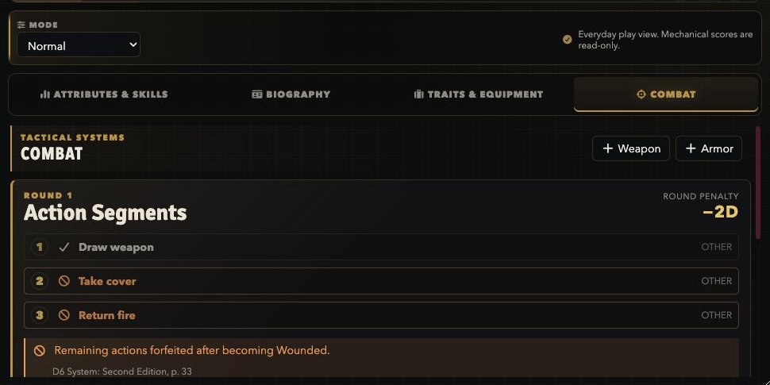

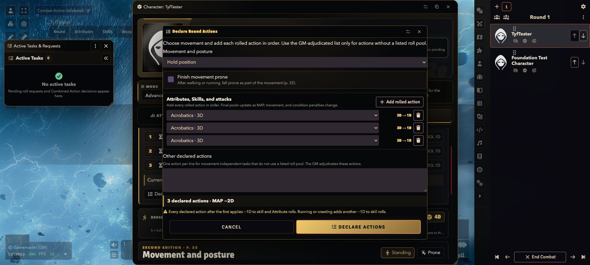

The declaration also records the round's movement choice. Walking allows up to
5 metres, running up to 10 metres, and a prone Actor may crawl up to 2 metres.
Running or crawling adds another −1D to Skill and weapon Attack rolls, but not
to Attribute rolls. Standing up is an action
and prevents other movement that round. A Walk or Run can be marked **Finish
movement prone**; completing that action changes the sheet posture to Prone.
Completing Stand changes it to Standing. The system validates these choices but
never invents a destination. Use **Move Token** and point to a destination on
the active Scene. The nonmodal picker shows the snapped route distance and
applicable maximum, rejects movement-wall paths and over-range destinations,
and allows right-click or Escape cancellation. When the current declared
segment is Walk, Run, or Crawl, only that matching mode is accepted; a successful
Token update completes the segment, while a revision failure restores the
Token's original position. Outside Combat, choose the movement mode explicitly.
Moderate cold halves the enforced maximum. See D62e p. 32.

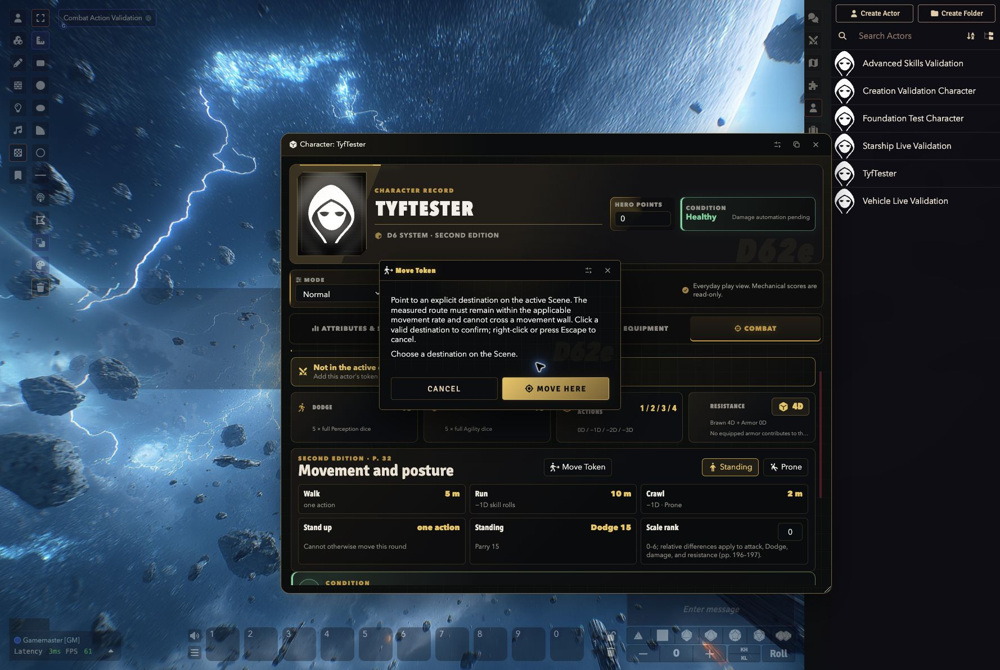

Combat actions belong to the exact Actor represented by the Combatant. For an
unlinked Token, open that Token's Actor sheet to declare and complete actions;
the separate directory Actor has a different Foundry document UUID, is only its
prototype, and correctly remains outside that Token's combat state.

At the start of a new round, the Gamemaster-authoritative combat hook clears the
previous action declaration. Short Conditions, Staggered and Stunned, recover
to Healthy; Wounded and more severe Conditions remain in place.

Owners may reset before resolution. After the first action completes, correction
is restricted to the Gamemaster. Attribute, Skill, and weapon Attack rolls
consume the same separately audited MAP, movement, and Condition penalties.
Resistance deliberately does not:
D62e p. 34 excludes multiple-action and wound penalties from Brawn resistance.

### First Edition flexible actions

First Edition does not reuse the ordered Second Edition scheduler. With
**Optional assistance**, a Combatant's sheet shows a count-only **Flexible
actions** tracker. Choose the total number of actions when the character's turn
arrives; the individual actions do not need to be named in advance. The tracker
applies −1D to every action roll beyond the character's base action allotment,
pre-fills that MAP in the shared roll builder, and records spent versus
remaining actions. See OD6 p. 58.

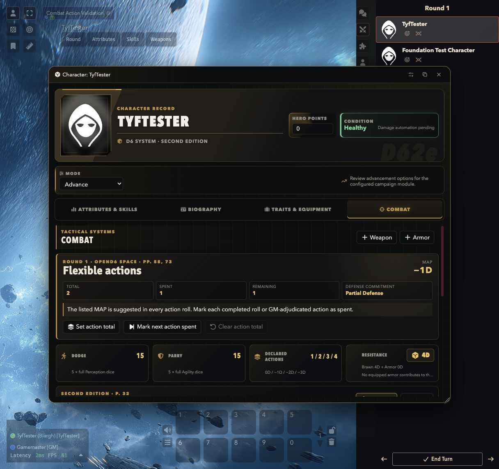

If an attack forces a Dodge before the character's normal turn, the Gamemaster
asks whether further actions are planned. Set the complete total, choose
**Partial Defense**, and mark the reaction as already spent. The resulting MAP
therefore applies to the Dodge immediately and to later actions. Unused
committed actions are lost at round end.

**Full Defense** is exclusive: its total is fixed to one action and its MAP is
0D. After a defense is committed, use the typed **Dodge**, **Block**, or
**Parry** buttons on the Combat tab. Partial Defense applies tracked MAP. Full
Defense ignores MAP and adds the printed +10 automatically. Its result becomes
the active difficulty and remains visible in roll/chat audit. See OD6 p. 73.

Characters with an ability that increases their action allotment may enter that
larger value. MAP begins only after the allotment is exceeded. The minimum-1D
rule still applies to every tracked or manually entered MAP. Players may clear
an unspent commitment; after an action or reaction is spent, only the
Gamemaster may correct it.

### First Edition relative movement

With First Edition movement active, the header exposes the Actor's **Move** and
the Combat tab provides land, swim, climb, and fly/zero-G movement. Choose the
type and terrain modifier, then point to the explicit Token destination; the
measured Scene route replaces manually transcribing a distance. Up to half
the relevant movement rate is free. Longer movement is an action; terrain and
extended distance determine difficulty. The planner enforces the four-times-
rate cap and posts a chat audit. A non-free move spends a tracked flexible
action when a commitment exists, while verbal/manual table play does not force
a tracker commitment. When the printed movement rules require a check, the
planner opens Running, Swim, Climb/Jump, or Flying/0-G with the difficulty
fixed. If the Skill is absent, it rolls the governing Agility or Strength
Attribute. Cancelling that check does not spend the action. A successful check
moves the Token. On failure, the action and audit remain resolved but the Token
stays put because the printed fallback distance or a fall requires GM
adjudication. See OD6 pp. 63–64.

### First Edition Body Points

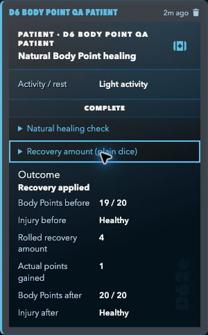

The Open D6 First Edition settings offer one mutually exclusive **First Edition
damage track** selector:

- **Wounds** keeps the existing Strength-plus-armor resistance, wound
  progression, penalties, and step healing.
- **Body Points** uses current/maximum points without intermediate wound
  penalties.
- **Body Points + wound bands** derives the printed Stunned through Mortally
  Wounded bands from the remaining percentage. The derived track is read-only.

Switching modes preserves the inactive Wound and Body Point values. It does not
convert or erase campaign data. Native Second Edition Conditions, Vehicle and
Starship damage, and their resistance pools are unchanged.

On the Combat tab, **Roll maximum** rolls the Actor's Strength and adds 20. A 1
on that roll is ordinary and does not invoke a Wild Die mishap. Rerolling an
existing maximum asks for confirmation, sets both current and maximum to the
new result, and posts a source-cited public audit. A GM in **Free Edit** may
enter the maximum directly; an owner may edit current points. See OD6 p. 14.

Body Point damage rolls armor and special resistance only. Strength is not part
of an ordinary Body Point resistance pool. The GM-only action on the original
targeted Damage card subtracts positive Damage-minus-resistance from current
points once and records the resulting points, percentage band, and source in
chat. Stun-only damage first rolls armor, then rolls Strength without wound or
action penalties, and subtracts only what remains. Any point loss causes the
printed temporary unconsciousness. See OD6 pp. 75–76.

**Natural healing** asks whether the preceding day was full rest (+1D), light
activity, or strenuous activity (−1D), then rolls Strength. **Assisted healing**
rolls the selected owned healer's Medicine. The result selects the full printed
recovery table: 0, 2 points, or 1D through 6D points, capped at the maximum.
The once-per-day Medicine limit and optional longer rest-period rule remain
Gamemaster calendar decisions. See OD6 pp. 78–79.

At 1%–9%, and at zero while revival remains possible, the Actor is Mortally
Wounded and uses the existing active-GM round clock. Medical aid must restore
at least 10% of maximum. Aid within four minutes revives without Skill loss;
aid during minutes 5–10 or 11–15 requires Strength or Stamina against elapsed
minutes and permanently removes 1D or 2D from Skills without taking a Skill
below its Attribute. Failure, aid after 15 minutes, or another full maximum of
damage below zero is fatal. The system stores Skill bonuses separately, so the
floor is represented by a zero bonus. See OD6 p. 76 and Rules Ruling 6.

### Legacy First Edition accumulating stuns

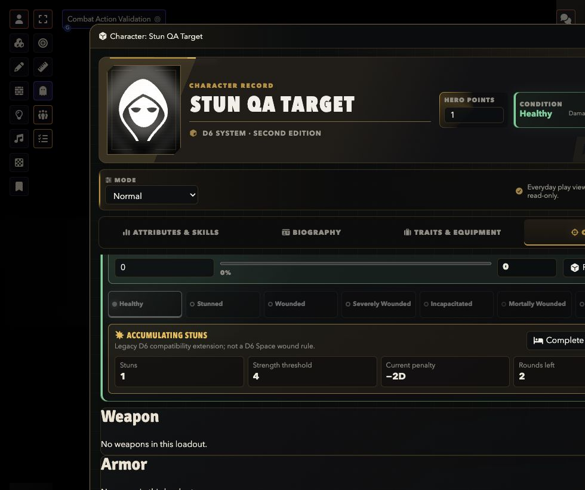

The Open D6 First Edition setting **Track accumulating stuns (legacy
compatibility)** enables a separate, off-by-default compatibility extension.
D6 Space pp. 75–76 do not contain this count-and-threshold mechanic; the normal
stun-only weapon rule remains the default when the option is off.

With the option enabled, every positive stun hit adds one persistent stun. The
Combat tab shows the current count and the unconsciousness threshold, equal to
the Actor's whole Strength dice. Net differences 1–3 apply a noncumulative −1D
ordinary-action penalty; 4–8 apply −2D. The penalty lasts for the current and
next round, and the primary active Gamemaster advances it once per true Combat
round. Resistance, recovery, and other action-exempt rolls do not receive this
penalty.

Reaching the threshold makes the target unconscious for a separate 2D minutes.
A net difference of 9 or more retains immediate unconsciousness for the positive
Damage-minus-resistance difference in minutes. The original Damage card records
the count, threshold, penalty, rounds, and explicit compatibility provenance.
State persists if the setting is disabled and becomes active again unchanged.

After one uninterrupted minute of rest, an owner or Gamemaster may choose
**Complete 1-minute rest** and confirm the reset. Round transitions clear only
the short penalty; they do not erase the persistent count.

**Manual table workflow** hides both edition trackers. Players can always tell
the Gamemaster their actions and enter the agreed MAP directly in the roll
builder.

### Static defenses

With core Second Edition defenses, the Combat tab derives:

- Dodge from full Perception dice; and
- Parry from full Agility dice.

These are derived presentation values, not stored character scores. See D62e
pp. 21, 33.

When **Science Fiction Skills** is active and Flying/0-G is present, the Actor
owner may select the complete Flying/0-G Die Code as Dodge's alternate basis.
The choice persists on the Actor and targeted attacks consume the same value.

The posture control records Standing or Prone. A prone target gains +10 Dodge
against ranged attacks, while Dodge and Parry are capped at 10 against melee
attacks. Wounded and more severe Conditions put the Actor prone. The Combat tab
shows both the current posture and the resulting defense context.

When **Module: No Dodge Defense** is enabled, the sheet removes the Dodge
value and its posture modifier. Personal ranged attacks instead use the fixed
range difficulties on D62e p. 94: Point Blank 5, Short 10, Medium 15, Long 20,
or Long 30 when the target is dodging. Parry and machine Defense remain in use.

### Targeted attacks and range

When the acting character has a token on the current Scene, a weapon Attack
dialog lists the other character, NPC, and creature tokens. A currently
targeted token is preselected. The dialog measures distance, shows the weapon's
short, medium, or long range band (or melee adjacency), and sets the correct
static Dodge or Parry as the difficulty. With **Module: No Dodge Defense**, a
personal ranged target instead shows Point Blank 5, Short 10, Medium 15, or
Long 20. At Long range only, **Target is dodging** raises that difficulty to 30. An attack must exceed the resulting defense; equality fails. Out-of-range
attacks are stopped before dice are rolled.

For a targeted Second Edition ranged Attack, **Cover defense modifier** accepts
the nonnegative flat value adjudicated by the Gamemaster. It adds to the
target's base defense and updates the displayed difficulty before the
roll. The book explains taking Cover but supplies no fixed Cover values (D62e
p. 30), so the system offers no quarter/half/full presets and does not infer a
modifier from Token position. The public chat audit shows
`base defense + Cover = effective defense`. This control does not appear for
melee, Damage, resistance, or First Edition rolls.

The resulting chat card and structured roll flags retain the target, weapon,
range, distance, and defense for audit. A targeted weapon Damage roll adds a
GM-only **Resolve damage** action to its chat card. Players can roll and see the
result, but only a GM can resolve and apply it.

### Hyper-lethal combat

**Module: Hyper-lethal Combat** provides four independent campaign options
from D62e pp. 89-90:

- **Remove Stunned** makes Wounded the first normal damage level. Repeated
  Wounded results retain the standard Incapacitated and Mortally Wounded
  progression.
- **Remove Wounded** makes Stunned the first normal damage level and Mortally
  Wounded the next. Enabling both removal options leaves Mortally Wounded as
  the only normal damage level.
- **Killing Blows** immediately makes a personal target Dead when its Brawn
  resistance total is strictly less than half the Damage total. At exactly
  half, ordinary damage resolution applies. A target with a Hero Point may
  spend one to survive the Killing Blow, after which the hit resolves normally.
- **Cap Brawn + Armor at 6D** limits the personal Brawn-plus-equipped-Armor
  pool before rolling. Any relative Scale modifier remains separately visible
  and auditable.

These options apply only to targeted personal Second Edition damage. Vehicle
and Starship Hull-plus-protection damage, First Edition wounds, environmental
direct Conditions, and manual Condition changes retain their own rules. The
character resistance card shows the configured 6D maximum, and resistance and
Damage chat cards retain the active rule, source page, Killing Blow decision,
Hero Point expenditure, and applied Condition.

### Relative scale

Characters and machines use scale ranks 0 through 6. The rank alone does not
change a pool; only the difference between two participants matters. A scene
target or damage source can therefore add the D62e pp. 196–197 modifier directly
in the roll dialog:

- a smaller attacker adds +1D per rank of difference to the Attack pool;
- a smaller ranged target adds the same bonus to Dodge, but never Parry;
- a larger attacker adds it to a weapon Damage pool; and
- a larger defender adds it to Brawn resistance.

The dialog updates the final pool before rolling, including the doubled Hero
Point preview. The chat card records the application, both ranks, the modifier,
and the page reference. Select **No target** or omit a damage source when no
relative-scale comparison applies. A Damage roll must have a selected personal
target to offer the automatic resolver.

### Condition track

The sheet displays the track selected by the active damage strategy. The
persisted Second Edition track includes Healthy, Staggered, Stunned,
Wounded, Incapacitated, Mortally Wounded, and Dead. Selecting a state updates
the header and Combat tab using the same semantic colors.

The independent First Edition Space track includes Healthy, Stunned, Wounded,
Severely Wounded, Incapacitated, Mortally Wounded, and Dead. It never converts
or overwrites the Second Edition state. Wounded, Severely Wounded, and
Incapacitated apply -1D, -2D, and -3D to ordinary action rolls; resistance
remains exempt.

First Edition also displays a separate consciousness panel when required.
Choose **Stun** in a Weapon's Damage Type field to use stun-only damage. The GM's
targeted Damage action then reduces the ordinary Wound result by two levels,
never below Stunned, without changing the physical Wound track. Any resulting
injury makes the target unconscious for Damage minus resistance minutes. A
fully resisted attack records that it caused no stun injury.

Applying Incapacitated requires the target to choose a free **Stamina** or
**Willpower** Moderate (15) check. Success leaves the character conscious at
the normal -3D Incapacitated penalty. Failure makes the character unconscious
for a separately rolled 10D minutes. Unresolved and unconscious characters
cannot make ordinary action rolls. The sheet retains the result across reloads
and provides **Mark conscious** for the owner or GM once the duration has been
adjudicated. Mortally Wounded remains unconscious until its wound is resolved.

When that track is active and the Actor is injured, the condition panel also
shows the applicable Wound healing tools from OpenD6 Space p. 79:

- **Natural healing** confirms the printed rest period before rolling full
  Strength. Stunned recovers automatically after one minute of complete rest;
  the other levels use their printed result table, including worsening on a
  Wild Die Critical Failure.
- **Assisted healing** selects an owned Actor with the Medicine Skill and locks
  the printed difficulty: 10 for an unconscious Stunned patient, 15 for
  Wounded or Severely Wounded, 20 for Incapacitated, and 25 for Mortally
  Wounded. Success improves exactly one Wound level. Foundry reminds the group
  that only one attempt may be made for a patient each day; the GM remains the
  authority for elapsed campaign time and whether a Stunned patient is
  unconscious. At Mortally Wounded the same button is labelled **Stabilize with
  Medicine**: success at difficulty 25 improves the patient to Incapacitated,
  which ends the mortal clock without inventing a separate recovery state.
- **Death check** remains available as a manual elapsed-time fallback. During
  Combat, the primary active GM instead rolls the check automatically whenever
  Foundry advances to the next round. The sheet shows completed mortal rounds
  and elapsed whole minutes; 12 five-second rounds equal one minute. A typed
  public chat audit records those values, the locked difficulty, and p. 76.
  Duplicate delivery of the same completed round is ignored. A Strength total
  below elapsed whole minutes changes the Actor to Dead; meeting or exceeding
  it survives that round's check.

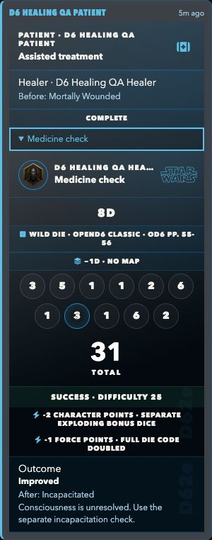

These checks deliberately bypass combat action/MAP and wound penalties. The
rules-set difficulty is displayed read-only in the normal roll builder, so roll
visibility and Wild Die handling remain auditable without allowing the printed
threshold to be edited.

At the start of the next Combat round, the GM client automatically clears
Staggered and Stunned. Longer-lasting Conditions remain until their separate
recovery requirements are resolved. This automation is inactive when the
First Edition damage strategy is selected.

When an eligible transition would make the Actor Stunned, the system offers the
verified Hero Point prevention choice from D62e p. 28. It prevents that proposed
transition; it is not a recovery action for an Actor already Stunned.

For a targeted Damage chat card, the GM selects **Resolve damage**. The system
opens the target's normal Brawn-plus-armor resistance builder with the attacker
preselected as its damage source, so scale and roll visibility remain visible
and auditable. The Damage total is the fixed difficulty and Brawn must exceed
it; the builder displays that threshold before rolling. The Damage card retains
its original source and scale context even if that source's Token has since
left the scene. After that roll:

- Brawn greater than Damage causes Staggered;
- another Staggered result while already Staggered causes Stunned;
- Brawn equal to or lower than Damage causes Wounded;
- a Brawn-roll Complication on that failed resistance instead causes Mortally
  Wounded; and
- repeated Wounded results progress to Incapacitated, then Mortally Wounded.

If the transition would cause Stunned and the target has a Hero Point, the GM
chooses whether to spend it to prevent the transition. The original Damage card
then records both totals, the incoming result, the applied Condition, and
whether prevention occurred. If the result freshly makes the target Wounded,
the card also records that every remaining action was forfeited for the round.
The applied flag prevents normal duplicate
resolution. Vehicle and Starship damage remains a separate rules workflow.

With First Edition damage active, the same GM action instead rolls the target's
Strength/Brawn plus equipped armor and subtracts that resistance from Damage.
A difference of 1-3 causes Stunned, 4-8 Wounded, 9-12 Incapacitated, 13-15
Mortally Wounded, and 16 or more Dead. A repeated or lesser injury advances the
existing wound one level, which supplies the distinct Severely Wounded step.
The Damage card records the First Edition strategy, both totals, the difference,
and the applied wound. See OpenD6 Space pp. 75-76.

### Weapons and armor

The Combat loadout can create, equip, edit, and roll Weapons and Armor.
Weapon Attack and Damage and Actor resistance use the shared roll pipeline.
Resistance combines effective Brawn with the strongest equipped body armor.
One equipped item classified as a **Shield** may add to that armor; multiple
body armors or shields do not stack. The Combat tab shows the derived pool and
its contributing equipment before rolling.

### Chase tracker

Enable **Module: Chases** in the Second Edition settings application to add the
route control to Token Controls. The control opens a tracker stored on the
current Scene, so its participants, rolls, Distance, and completed exchanges
survive reloads.

The GM starts a chase by choosing one representative Actor and one embedded
Skill or Specialization for each side. The normal starting Distance is 4; the
GM may choose another active value from 1 through 7 when the fiction calls for
it. Each representative may use a different Skill, as described by the module.
Only the representative's owner or a GM can roll that side. Player rolls are
submitted to the active GM before the Scene flag changes.

After both sides roll, the GM resolves the exchange. The higher opposed total
wins; ties use the ordinary p. 25 order described above. A pursuer win reduces
Distance, and a fleeing-party win increases it. The normal shift is 1; select
**Exceptional Success** only when the winning result merits the printed
two-step shift. Distance 0 means the pursuer catches the fleeing party, while
Distance 8 means the fleeing party escapes (D62e pp. 73–74).

Each ordinary Skill roll keeps its own chat card. Resolution adds a shared audit
card containing both totals, both Wild Die outcomes, the tie ruling when used,
the Exceptional Success decision, and the exact Distance change. Because the
core Wild Die result may remain an unresolved Advantage or Complication until
the opposed result exists, the GM makes that final table ruling explicitly; the
tracker never silently converts it. Ending a chase requires confirmation and
clears only that Scene's chase flag.

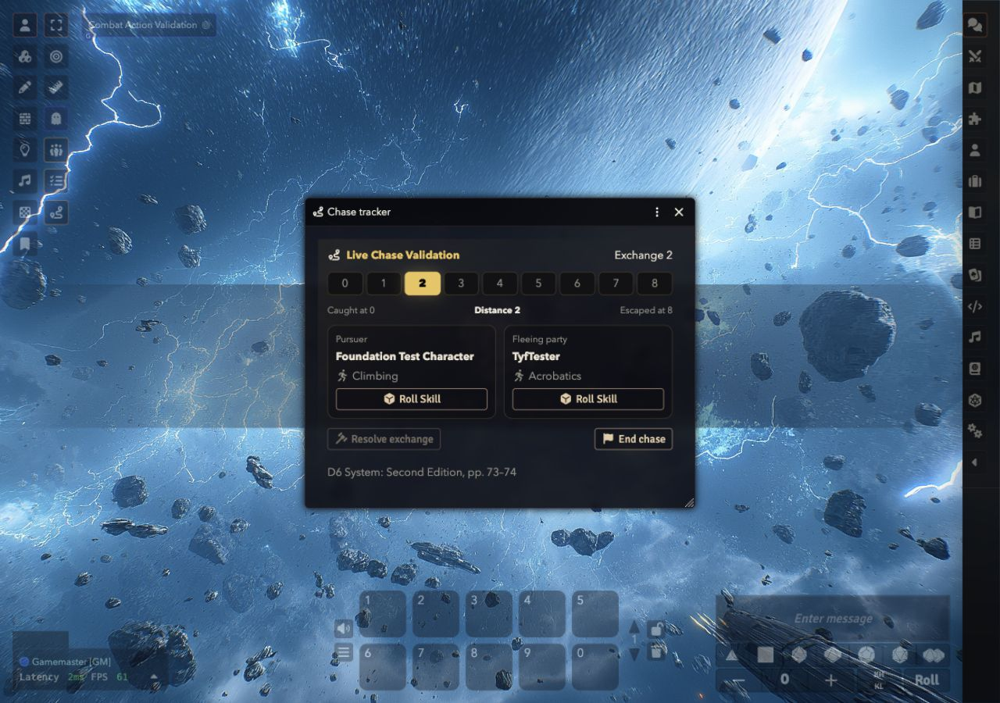

### Environmental hazards

Enable **Module: Environments** in the Second Edition settings application to
add the cloud-bolt control to Token Controls. This GM-only manager lists every
Character, Creature, and NPC, its safe-breath allowance, and any current
environment effect.

Choose **New exposure**, then select an Actor, cold, heat, poisonous air, or
drowning, and the applicable severity. The system opens the ordinary roll
builder with the printed difficulty locked and rolls Stamina, falling back to
Brawn when the Actor has no Stamina Skill. A successful check leaves no effect.
A failed check stores the hazard and applies the printed result (D62e pp. 77-78):

- moderate cold imposes −1D on all rolls and halves the movement limits shown
  in the combat declaration workspace;
- moderate heat or poisonous air imposes −1D on all rolls;
- severe cold or heat imposes −2D on all rolls and turns later Stunned results
  into Wounded;
- severe poisonous air causes Incapacitated;
- deadly cold, heat, or poisonous air causes Mortally Wounded; and
- consecutive failed drowning checks progress through Incapacitated, Mortally
  Wounded, and Dead.

The penalty applies to ordinary actions, Damage, and resistance independently
of MAP, and the final roll card names the hazard, severity, effect, and source
page. The Character Combat workspace shows the active effect and adjusted
movement limit. Drowning allows a number of rounds equal to the Actor's Stamina
Die Code before the GM begins the end-of-turn checks; the manager displays that
allowance.

Use **Aid** to choose an owned helper and Skill. The check uses the original
exposure difficulty, and success removes the effect. **Safe day** is the other
confirmed recovery path after the group has actually spent about a day in a
safe place with the needed remedy. Recovery restores a Condition caused by that
effect only if a later injury has not replaced it.

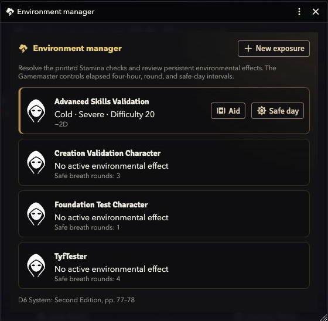

Foundry does not decide when four hours or a drowning turn has elapsed, detect
damaged protective equipment, invent extra poisonous-air penalties, or advance
campaign time. The GM remains responsible for those fictional and timing
decisions.

## 9. Campaign Configuration Reference

### Current rules summary

Before changing a long list of controls, establish the world in plain language:

- **Baseline:** D6 System Second Edition or Open D6 First Edition.
- **Active rules:** the rules components that currently affect play.
- **Cross-edition choices:** substitutions or extensions borrowed from the
  other edition.
- **Dependencies:** required rules components that are active or still missing.
- **Warnings:** partial, planned, incompatible, or unresolved behavior.

The root Game Settings category now identifies the selected baseline and whether
the resolved profile still matches it or includes explicit optional or
cross-edition choices. The edition workspaces retain the detailed campaign
profile and capability matrix. A later Settings pass will separate routine
configuration from Rules Inventory auditing inside those workspaces.

### Root Game Settings

Root system settings contain options useful in either edition:

- the world-scoped **Game System Mode** selector and current system-mode summary;
- enabled **Configure** access for the active edition and disabled access for
  the inactive edition;
- world and personal theme;
- default roll visibility and difficulty;
- visibility of difficulty, modifier, and opposed-roll controls;
- visibility of Advantages and Disadvantages; and
- visibility of Specializations.

The world-level **Enable GM Quickbar** and **Enable Active Tasks & Requests**
preferences are Gamemaster settings. Foundry does not expose those controls in
player Game Settings. Edition-owned rules controls are intentionally absent from
the root list and remain available through the dedicated edition workspaces.

### D6 System Second Edition configuration

The **D6 System Second Edition** submenu begins with **Settings at a glance**, a
compact matrix of its active and inactive boolean rules settings. The matrix
updates immediately when a switch changes, and each matrix cell is itself a
keyboard-accessible toggle for the matching checkbox. Active cells use green
status text, marker, and border. The remaining configuration is organized like
the rulebook's campaign worksheet. Each configurable card identifies whether it
is core setup or an optional module and shows the relevant printed pages:

Its single purple **Tyfusius Home Brew** card is deliberately last, after the
edition's standard settings, profile, inventory, and capability information. It
contains only the Second Edition Brawn-adjusted grenade-range option and no
additional edition-specific wrapper. The option remains world-scoped and
disabled by default.

- **Core campaign setup** (D62e pp. 20, 28) contains the additional
  Skill-module count and automatic bookkeeping.
- **Module: Additional Attributes** (pp. 62-68) contains Charm, Mechanical,
  Technical, Mysticism, and Magic.
- **Module: Hero Points** (pp. 75-76) selects Heroic, Basic, or Classic; it
  contains the strategy-specific starting and session controls and enforces
  Classic's Wild Die and advancement dependencies.
- **Advancement modules** (pp. 86-93) selects no more than one of Experience
  Points, Milestone Character Advancement, or Narrative Advancement.
- **Module: Hyper-lethal Combat** (pp. 89-90) independently configures a
  shorter Condition track, Killing Blows, and a 6D maximum Brawn-plus-Armor
  resistance pool.
- **Module: No Dodge Defense** (p. 94) replaces personal ranged Dodge with
  fixed range-band difficulties while retaining Parry and machine Defense.
- **Module: Pips** (pp. 94-95) enables `+1` and `+2` Die Code steps.
- **Module: Skill Specializations & Advanced Skills** (pp. 96-100) enables the
  supported granular Skill structures.
- **Fantasy Skills & Freeform Magic** (pp. 141-159) enables the optional
  Fantasy catalog and the dependency-gated Manifestation workflow.
- **Module: Science Fiction Skills** (pp. 173-176) enables Flying/0-G, Barter,
  Gambling, Gunnery, and Streetwise, retains core Languages, and exposes the
  source-cited Flying movement and Dodge-basis controls.
- **Psionics** (pp. 184-190) adds three independent discipline Skills, first-die
  training, and the authorized power-catalog workflow.
- **Cyberpunk** (pp. 191-195) adds personal and cyberware Firewalls, hacking,
  turn-scoped hardening and disabling, augmentation capacity, and Medicine
  installation.
- **Magic Points Casting** (pp. 160-162) adds Mystical Alignment and the
  protected current/maximum Magic Point track. Manifestation casts spend the
  displayed cost and succeed without a casting roll; **Recover one hour** adds
  the caster's Magic whole dice up to maximum.

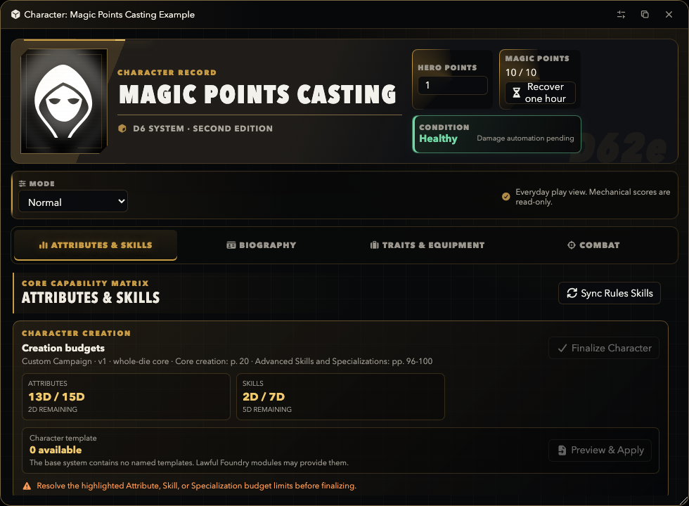

- **Active & Responsive Combat** (pp. 162-164) adds Full Defense and targeted
  Feint controls to the Combat workspace. Full Defense is the only round
  action. Feint requires Melee 4D and an already targeted scene Token. Melee
  Wild Die reaction buttons appear on eligible chat cards. Weapons with an
  Autofire rating prompt for the attack reduction and carry twice that value
  into the next completed Damage roll.

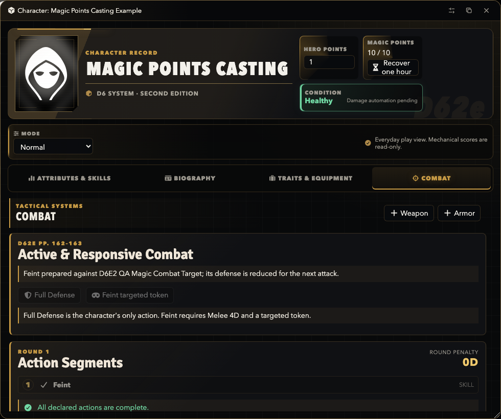

The active cards are the currently implemented configurable subset. The
GM-only workspace lists every printed Core, Fantasy, Science-Fiction, and
Superheroic module with its page reference, state, dependencies, and
incompatibilities. During development, unfinished modules are shown as
**Planned / not yet available**; they are never selectable controls that
silently do nothing. The broad full-rulebook 1.0 target requires every catalog
entry to become functional.

The **Every printed module** catalog below the active cards contains 41 entries
in four collapsible sections. It intentionally combines the book's introduction,
table of contents, and shortened Module Worksheet. This includes modules omitted
from the worksheet itself: the general and genre bestiaries, templates, Scale,
Superheroic Hero Points, Capping Die Codes, and Secret Identities. Every entry
shows one of four honest support states:

- **Available · configurable** links to a working setting above.
- **Available · built in** identifies implemented system behavior that is
  currently always present when its Actor or workflow is used.
- **Partial support** identifies a real implemented foundation whose complete
  printed module is not finished.
- **Planned · unavailable** is visible for campaign planning but has no
  selectable control.

Mutually exclusive Initiative, Wild Die, Hero Point, and Advancement families
use one choice control per family. The settings workspace prevents incompatible
combinations and explains dependencies. Players cannot change these world rules;
the controls remain restricted to Gamemasters. The resolved campaign profile
and cross-edition capability matrix below the module cards show what the system
will actually apply.

### Open D6 First Edition configuration

The **Open D6 First Edition** submenu also begins with the compact, live
**Settings at a glance** matrix. It owns the complete preset and independent
compatibility switches. Settings that affect only one edition do not appear as
ambiguous root toggles. **Use First Edition Initiative Rolls** switches between
Perception-based tracker initiative and the selected native Second Edition
strategy. The tracker refreshes immediately when this option changes. Its
single purple **Tyfusius Home Brew** card appears last and contains the First
Edition segmented-action queue and Strength-adjusted grenade-range options
without another edition-specific wrapper. Both remain world-scoped and disabled
by default.
Both restricted edition menus expose the same **Action declaration assistance**
choice so the table workflow is easy to find without duplicating its world
state. It is intentionally absent from players' native Game Settings.

## 10. Optional Campaign Workspaces

These workspaces appear only when their rules components are available and
active. Begin with the resolved campaign summary in chapter 9, then use this
chapter for the table procedures and examples that do not belong in the root
Game System Mode checklist.

### Tyfusius Home Brew

The GM-only **Tyfusius Home Brew** sections live inside the edition workspaces
rather than appearing as a third root destination. Open D6 First Edition owns
its segmented-action and Strength-adjusted grenade rules; D6 System Second
Edition owns its Brawn-adjusted grenade rule. Every switch is world-scoped,
independent, and disabled by default. Players cannot change these settings, so
the GM should tell the table which house rules are active.

**First Edition: segmented action queues** changes how declared actions are
ordered. Each combatant first enters a complete queue. Choose a linked
Attribute, Skill, or weapon action when Foundry should show its final pool, or
use a short freeform label for an action the GM will adjudicate. Foundry waits
until every active combatant has declared. It then resolves everybody's first
action in initiative order, followed by everybody's second action, and so on.

For example, Ada declares three actions and Bex declares two. If Ada has the
higher initiative, the order is Ada action 1, Bex action 1, Ada action 2, Bex
action 2, then Ada action 3. Ada has a 2D MAP and Bex has a 1D MAP throughout;
neither character borrows the other's action count or penalty.

If someone must Dodge, block, or parry an attack before their initiative place,
declare that defender's complete queue immediately and mark the defense as
already spent. That consumes only the defender's first queued action. The
remaining actions still occur in their normal later segments. Full Defense must
be the queue's only action.

Each action segment also permits movement. Foundry looks at every linked Skill,
Attribute, weapon, and Running action in that character's queue after MAP. The
number of full dice in the lowest pool is the first movement limit. The second
limit is **Move divided by that character's declared actions**; use the lower of
the two. Freeform actions have no pool, so link at least one queued action when
you want Foundry to calculate movement automatically.

For example, Kael has Move 12 and declares three actions. His lowest linked pool
after MAP is 3D. Three dice permit 3 meters, while Move 12 divided by three
actions caps him at 4 meters, so Kael may move 3 meters in each normal segment.

Choose **Running** as a queued movement action when the character tries to run.
Its Difficulty is 5 for each declared action, so Kael's three-action Running
Difficulty is 15. Success doubles that segment's movement to 6 meters. Failure
still spends the Running action and keeps its MAP, but allows only the normal 3
meters. If the Running Wild Die 1 becomes a **Complication**, every other action
is lost and the character receives only one normal 3-meter movement total.

In the movement dialog, check **This is reactive movement** only while responding
to another character's current segment. The reaction spends the reacting
character's own next action and uses that character's own queue, MAP, action
count, and Move. A guard with two actions can therefore move farther than Kael
with three. The reactive move does not offer or trigger another movement
reaction.

**First Edition: Strength-adjusted grenade ranges** changes the printed ranges
of Weapons marked **Thrown explosive**. Enter the grenade's printed **Short
range begins**, Short end, Medium end, and Long end on its Item sheet. The
printed ranges assume Strength 2D. Add one meter to every boundary for each
Strength pip above 2D, or subtract one meter for each pip below 2D; a boundary
never falls below zero.

For example, printed ranges `3–4 / 7 / 12` become `6–7 / 10 / 15` for a
Strength 3D thrower. For Strength 1D they become `0–1 / 4 / 9`: Point Blank is
empty and zero meters counts as Short. The Weapon Attack dialog measures from
the thrower's active Token to the selected Token position, displays the
adjusted range band, and uses First Edition grenade-targeting difficulty 0 for
Point Blank, 10 for Short, 15 for Medium, or 20 for Long. The selected Token is
an aiming position; ordinary First Edition active defenses do not apply to the
throw itself. Blast placement, scatter, and affected targets remain GM
adjudication in this first bounded pass.

**Second Edition: Brawn-adjusted grenade ranges** is a separate switch for
native Second Edition play. It affects only personal Weapons marked **Thrown
explosive**. Enter the same fixed baseline boundaries: **Short range begins**,
Short end, Medium end, and Long end. The baseline assumes Brawn 2D. Each
effective Brawn pip above 2D adds one meter to every boundary; each pip below 2D
subtracts one meter, with zero as the minimum.

For example, baseline ranges `3-4 / 7 / 12` become `6-7 / 10 / 15` at Brawn 3D
and `0-1 / 4 / 9` at Brawn 1D. Brawn 4D+2 is eight pips above 2D, producing
`11-12 / 15 / 20`. This optional rule changes distance only. The attack still
uses the character's normal Second Edition pool and MAP, and the target still
uses the active Second Edition Dodge or No Dodge defense. Cover, scale, and the
selected Wild Die strategy continue to apply. First Edition's fixed grenade
difficulties are never used by this switch. Blast placement, scatter, and other
affected targets remain GM adjudication.

**Module: Alternate Wild Die** supplies one world selector for Core, Basic,
Classic, or Simple. The control is GM-only and affects the next Second Edition
roll immediately.

After changing a campaign-level rules option, reopen relevant sheets and review
the capability matrix. Some Foundry settings may require a reload; the settings
application reports this when applicable.

### Psionics

The GM enables **Use Psionics** under **Science Fiction Skills & Psionics**.
Characters then receive a separate Psionics tab with Kinesis, Perceive, and
Reform. These are independent Skills: an Attribute is never added to them.

To learn a discipline's first 1D, press **Learn first 1D** and record the
downtime that occurred in the story: one month of self-study or one week with a
teacher. This command works only while the discipline is untrained. Improve it
later with the normal advancement controls.

A power can require one or two disciplines. The roll uses each required
discipline's complete die code. For example, a contributed power requiring
Kinesis 2D and Perceive 1D rolls 3D. Every required discipline must be trained.
The roll card records its base difficulty, any GM-added difficulty, how many
times that power was attempted in the last 24 world-hours, any resulting
scaling difficulty, and the source citation. Failed attempts count too.

The public system deliberately contains no named power list or rulebook prose.
It provides the full workflow and a validated registry that an authorized or
private content companion can populate. When no companion is installed, the
Powers section explains why it is empty.

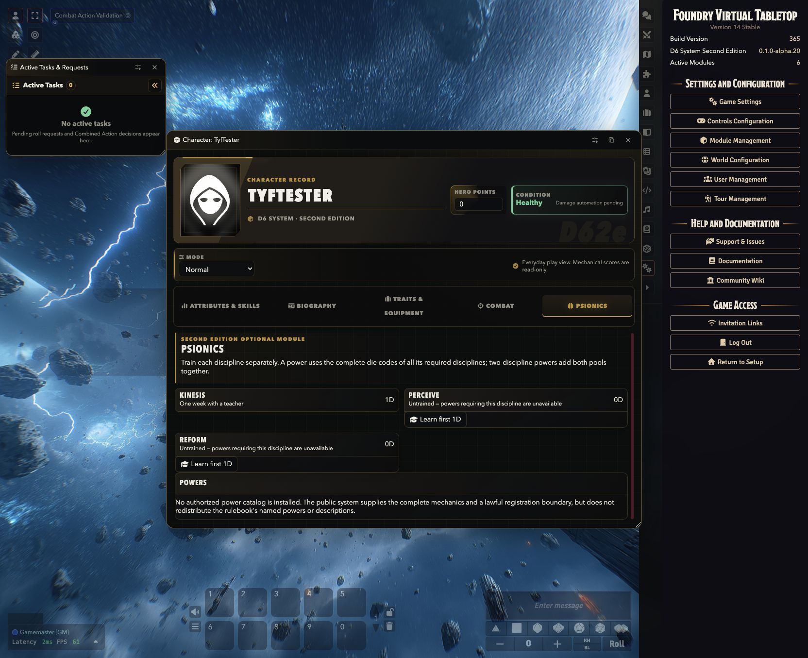

### Cyberpunk

The GM enables **Use Cyberpunk** under **Science Fiction Skills, Psionics &
Cyberpunk**. The module becomes active only when the Technical Attribute and
Science Fiction Skills are also enabled. Installing an augmentation additionally
requires **Perks, Flaws & Talents**, because cyberware changes a Talent rather
than creating a second copy of its benefit.

The Cyberpunk tab shows the character's personal **Firewall**. It equals five
times the whole dice in Technical: Technical 3D has Firewall 15. **Harden
Firewall** consumes the character's next declared action and adds 5 until the
end of that character's next turn. The active Combat round and turn are stored,
so reloading cannot extend the bonus.

Press **Hack a target** to roll Computers against a Firewall. Choose a known
Actor or installed cyberware to use its calculated Firewall, or choose a manual
network target and enter the number assigned by the GM. On failure by 5 or
more, the system rolls the consequence die and reports whether the attempt was
noticed or the hacker's identity was exposed. On success, the chosen outcome
is recorded for the GM. A selected cyberware item may be disabled for a number
of target turns equal to the whole dice in the hacker's Computers pool, or
fried so its user resolves the normal Brawn resistance workflow against 2D
damage. Operation, information, misdirection, traces, and fictional follow-up
remain with the GM.

Create a **Cybernetic** Item from the Traits & Equipment tab, then open it to
choose **Cyberware** or optional **Bioware**, link the Talent that supplies its
benefit, and enter the same rank. The wrapper does not change the Talent's cost.
Cyberware capacity is the character's whole Knowledge dice; bioware capacity
uses whole Brawn dice. Rank × 5 is the augmentation's Firewall, and rank × 5 +
5 is its displayed acquisition difficulty. The system deliberately does not
invent a currency model.

Use the install button on the Cyberpunk tab and select an owned character with
Medicine. Installation starts at Difficulty 10 and 60 minutes, adding 5 and 30
minutes for every earlier augmentation of that kind. Ordinary failure spends
the time and leaves the part available. If the roll also has a Wild Die 1, the
part quantity becomes zero and the patient immediately resolves the normal
Brawn resistance/damage workflow against the installation difficulty.

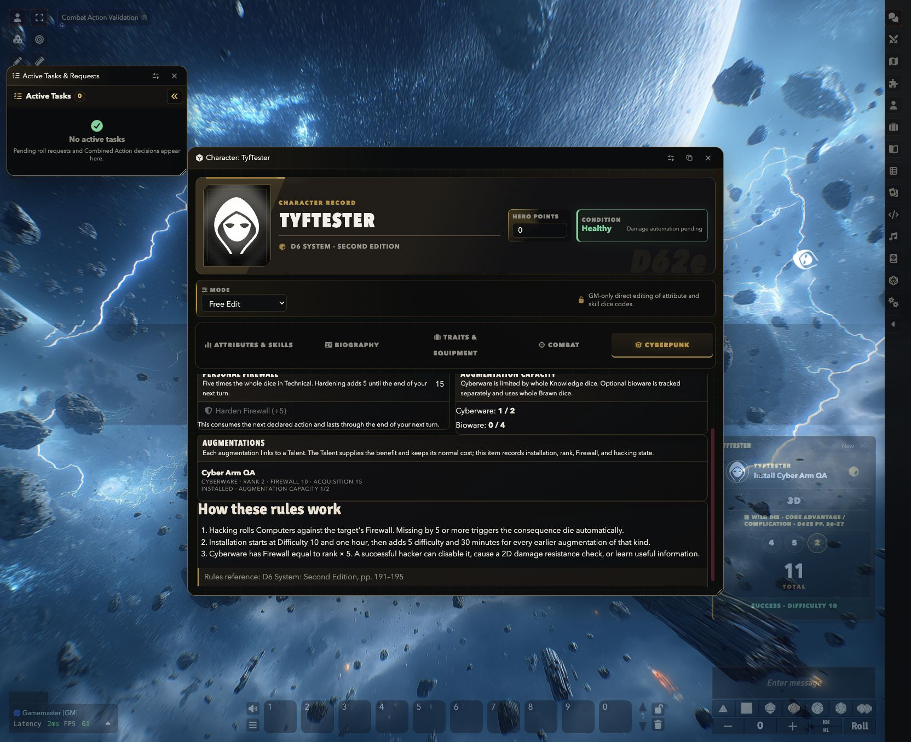

### Superheroic campaign foundations

The GM opens **Second Edition Settings → Superheroic campaign foundations**.
Each option is independent and disabled by default:

- **Superheroic Skills** adds Flying/0-G, Gambling, and Streetwise without
  duplicating a Skill already supplied by another genre module. New characters
  receive the printed extra 1D Skill creation budget.
- **Superheroic Hero Points** starts new heroes at 3 points. One point can add
  an action to an existing combat queue without increasing MAP, make a Talent
  count one rank higher for its current use, or be given to an eligible ally
  who has fewer than 3. A capped roll also offers **Ignore Die Code cap** in
  the roll dialog; it is an alternative Hero Point use for that roll.
- **Character Die Code cap** selects the printed 10D, 12D, 15D, 18D, 24D, or
  30D campaign level. The cap applies after bonuses, preserves +1 or +2 pips,
  and affects Character Actors only. NPCs, creatures, vehicles, and starships
  are deliberately exempt.
- **Secret Identities** adds a dedicated character tab. Enter the heroic and
  secret names there. The separate identity pool begins at 1 and cannot exceed 3. The GM awards **Reinforce identity** when the secret life plays a prominent
  active role. **Take clue** awards one point and adds one Suspicion; **Gain
  Suspicion** adds Suspicion without a point. Foundry rolls 1d6 visibly each
  time: a result equal to or below the new Suspicion exposes the identity.
  Exposed heroes lose access to the private pool until the GM clears the name,
  which resets Suspicion, or marks the identity permanently public.
- **Superpowers** enables a separate starting pool of 8D, 10D, 12D, 16D, 20D,
  or 24D according to the selected campaign level. It requires **Perks, Flaws
  & Talents**. To make a lawful custom power, create a Talent, open its Item
  sheet, check **This Talent is a Superpower**, and enter its base cost per
  rank. Add only the total costs for any custom or contributed enhancements
  and limitations you are allowed to use; the public system deliberately does
  not reproduce their protected printed names or descriptions.
- **Hidden Bases & Hideouts** enables standalone Hideout Actors. It requires
  **Perks, Flaws & Talents**, because a hideout may be acquired like a Talent.
  The public system provides the rule engine and custom-feature workspace but
  deliberately leaves the protected printed feature catalog empty.
- **Nemesis, Companions & Sidekicks** adds a protected relationship workspace
  to the Superheroic tab. It requires **Perks, Flaws & Talents** but does not
  copy the book's protected Feature names or descriptions.
- **Superheroic Templates** is a built-in contribution/apply workflow rather
  than another on/off switch. Its catalog entry shows the required Additional
  Attributes, Superheroic Skills, and Superpowers dependencies. Lawful public
  or private companion content appears in the ordinary Character Template
  preview when the campaign uses the required Charm/15D, Skills/8D, and
  Superpowers/10D profile.

The final Superpower cost is **(base + enhancement cost) × rank − limitation
credit**, with a minimum of 1D. Enhancement cost is paid again at each rank;
limitation credit is subtracted once from the whole Talent. The Superheroic tab
shows dice spent against the campaign budget. Mark a power **Automatic** when
its benefit is always available. Otherwise click **Rely on power** when its
benefit matters; Foundry records the declaration in chat. This declaration
does not itself spend an action unless the custom power says it does. A Skill
granted by a power advances as an ordinary Skill and does not automatically
increase when the Talent rank increases.

Enable **Gadgets & Gear** after **Perks, Flaws & Talents** and **Superpowers**.
Create an ordinary **Gear** Item, open it, and choose one of these superheroic
equipment types:

- A **Gadget** gives exactly +1D to one narrow use of one Attribute or Skill.
  Choose the target and write when it applies. For example, a climbing tool
  might add +1D to Athletics when climbing, but not to jumping or every other
  Athletics task. Equip it, then use **Use gadget** on the Superheroic tab.
  The shared roll card records the Gadget, +1D, the written use case, and p. 227. If the completed roll has a Complication, Foundry automatically marks
  the Gadget malfunctioning.
- **Superpower Gear** contains one or more lawful custom or contributed
  Superpower Talents already on the Character. Select those Talents on the Gear
  Item and save. The Superheroic tab lists each contained power. Their existing
  Superpower costs remain on the Talents; Gear combines those costs only when
  showing its normal rebuild time.

Copying or transferring Superpower Gear preserves a safe snapshot of the
contained powers and its original creator. When a different Character declares
use of one of those powers, chat records the printed −1D borrower penalty.
Automatic powers need no declaration, but the Gear must still be equipped and
ready for its benefits to be available.

The Gamemaster can mark Gear malfunctioning after a power-use Complication,
record destruction, repair a malfunction, or finish rebuilding a destroyed
item. The normal rebuild time is one day per die in the combined contained
power cost. The source does not give a universal repair roll or repair time, so
the table decides how repair is accomplished. A generic checkbox lets lawful
custom or companion content say that its limitation replaces normal rebuilding
without reproducing protected limitation names or prose.

With **Hidden Bases & Hideouts** enabled, create a **Hideout** from the Actors
directory. Choose Urban, Country, Wild, or Custom and describe where the
hideout is, how it looks, and anything important about its construction. These
facts guide scenes but do not add a numeric modifier. Every hideout always has
living quarters and ordinary supplies appropriate to its description.

A new hideout normally allows four features. The GM can raise or lower that
allowance for the campaign; an over-limit selection remains visible instead of
being silently deleted. Use **Custom** to record a feature your table created,
or **Contributed** to select lawful feature data supplied by a companion or the
ignored private-content module. Contributed prerequisites and whether a feature
can be chosen more than once are validated. The base system does not copy the
rulebook's named feature list or descriptions.

Set the hideout to **Individual** or **Group** and add the Character members who
use it. This roster describes the fiction. To let the corresponding players
open and edit the Hideout Actor, the GM also grants those users Owner access
through Foundry's standard **Configure Ownership** dialog. Owners may edit the
location, description, roster, and feature selections. Only the GM may change
the campaign feature allowance or relocation/rebuilding state.

If a hideout is compromised or destroyed, the GM can mark it Relocating or
Rebuilding. Foundry calculates the normal time as one game month per selected
feature and records completed months across reloads. The GM may enter an
explicit override when an adventure, reward, expansion, or other fictional
event changes that time; the system does not invent a roll or expense.

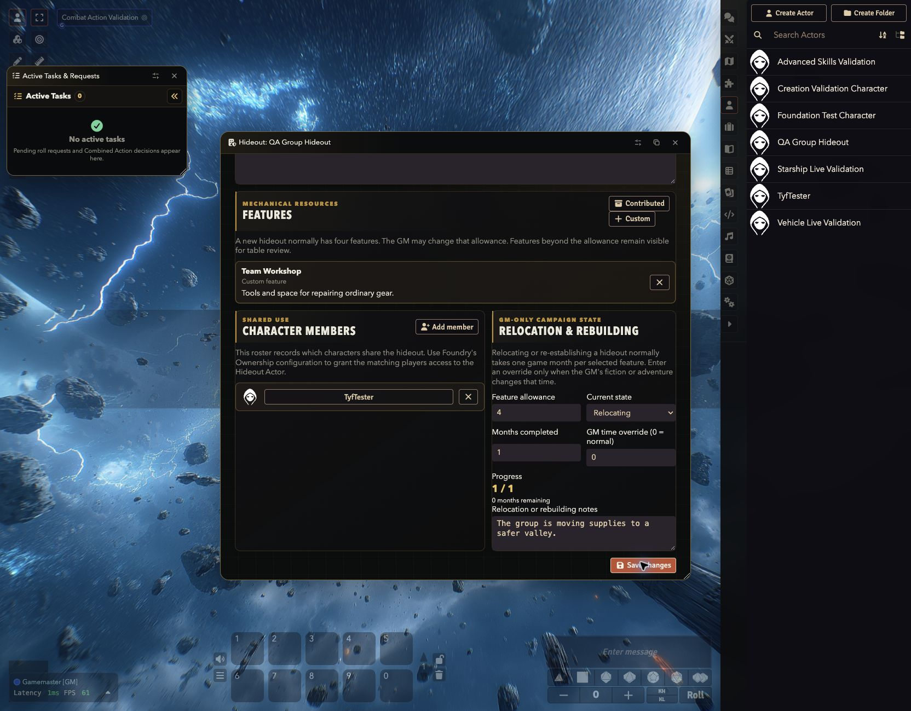

#### Nemesis, Companions, and Sidekicks

The GM configures these relationships on a Character's **Superheroic** tab.
They all use ordinary Character Actors and Foundry ownership, so there is no
separate supporting-character document type.

Use **Save relationship settings** after changing names, links, or Sidekick
options. **Clear relationship settings** is a GM-only cleanup control: it
removes every relationship link and encounter counter from that Character and
turns off Sidekick creation, but it does not change the Character's ordinary
attributes, Skills, equipment, or resource balances.

For a **Nemesis**, check **This actor is a Nemesis**, choose whether it opposes
one hero or the group, and select the linked hero or current award recipient.
Click **GM: begin encounter** at the beginning of every encounter. Foundry
rolls 1d6 openly, adds 3, and replaces any points left from the previous
encounter. These Nemesis Points appear wherever that actor would normally use
Hero Points, including rolls and defensive choices. For example, a roll of 4
starts the encounter with 7 points.

When the linked hero receives Experience, the same positive award is added to
the Nemesis in the background. Spending Experience does not reduce the
Nemesis. If the hero drives the Nemesis away or defeats it under the printed
conditions, the GM clicks **record defeat and award hero** to give the selected
hero 1 Hero Point. If a Nemesis still has points when apparently killed, the
points support its fictional escape; Foundry records the pool but leaves the
exact escape scene and health-state correction to the GM.

For a **Companion**, record the important person, creature, or touchstone by
name. When a meaningful scene with that companion should restore the hero,
click **Recover 1 Hero Point**. The owner may use this button and chat records
the recovery. Example: after a difficult mission, a hero takes time to reconnect
with a trusted friend and recovers one point.

For a **Sidekick**, use a new Character Actor, check **Use half starting-dice
budgets during creation**, choose the mentor, and mark the relationship active.
The GM must also confirm the Sidekick and mentor requirements described on
p. 236. That confirmation deliberately cites the page instead of reproducing
the protected named Feature entries.

The Sidekick starts with half the campaign's ordinary Attribute, Skill, and
Superpower dice. Odd totals round down to whole dice before normal Feature
accounting: 12D Attributes become 6D, 7D Skills become 3D, and a 15D power pool
becomes 7D. Flaw credit is then handled normally. The Sidekick advances like
another character; the GM can later mark the relationship **Independent** or
**Removed from play** without deleting its history.

Sidekick stories—especially those involving young people, dependency, or
danger—need the whole table's consent. The GM should remove or rewrite the
relationship if it becomes unsafe, uncomfortable, or disruptive.

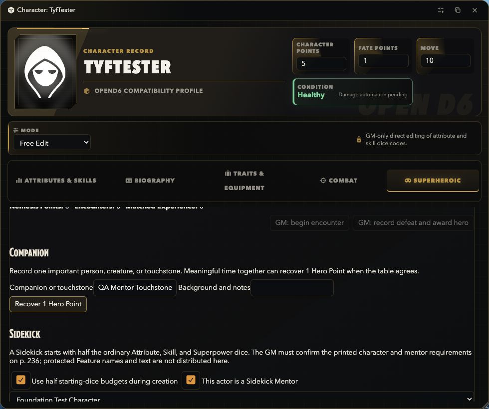

Every mechanical button produces audit chat with the rule-page boundary. Name
fields remain owner-editable, while point, Suspicion, and status changes use
protected commands. A player can give a point only to another Character they
also own; the GM can complete transfers between differently owned allies.

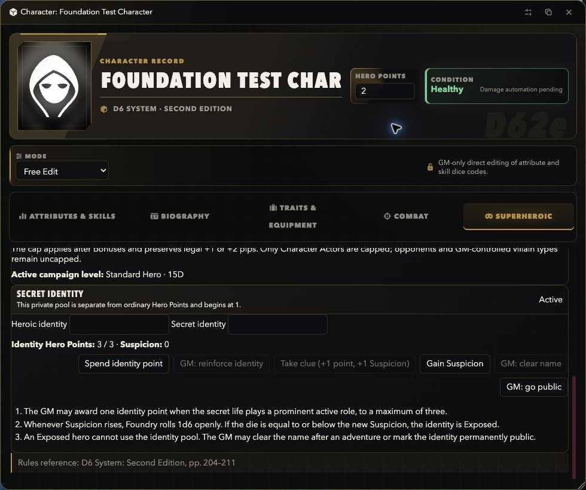

## 11. Compendiums and Content

Enable **D6 System Second Edition — Core Content** in **Manage Modules** to add
the citation-only Second Edition Skills pack and the 84-entry Equipment pack.
Their pack names and document IDs are unchanged from earlier alpha releases;
stored Actor and Item references migrate to the module namespace. Disabling the
module preserves existing Actor data but makes those source compendiums
unavailable until it is enabled again.

Enable **D6 System Second Edition — Fantasy** to add the four Fantasy Creature
Actors and four Fantasy Character Template Items. Their pack names and document
IDs are likewise unchanged; schema migration and runtime resolution preserve
references that used the earlier system-owned compendium namespace. The module
advertises **Fantasy Skills & Magic** as its recommended rules group, but
activation does not enable that group or alter the primary rules profile.

The available Skill packs cover:

- D6 System: Second Edition; and
- OpenD6 compatibility.

New characters receive the catalog for the active profile. A Gamemaster can use
**Sync Rules Skills** to add missing active-profile Skills to an existing
character. Synchronization preserves existing embedded Items.

When the **Open D6 Space** genre module is enabled, its ten compendiums add 277
ready-to-use mechanical records:

- Advantages, Disadvantages, and Special Abilities;
- Cybernetics and the three Metaphysics Skills;
- personal Gear, Armor, Weapons, and planetary Vehicle Actors;
- reusable ship-design components;
- five generic people and five generic animals; and
- all ten printed character templates.

Drag personal equipment, features, Skills, and uninstalled Cybernetics onto an
owned Character, NPC, or Creature. Drag a Vehicle Actor from its compendium into
the world. During Character creation, drag a Space template onto the sheet or
use **Preview & Apply**; the protected template transaction applies the printed
Attribute scaffold, records its source, and highlights the Skills the player
still needs to allocate. Templates with 1D in the optional Metaphysics Attribute
leave that 1D visibly unassigned until the optional Attribute is enabled and
allocated.

In Open D6 First Edition mode, the GM-only **Creature Catalog** also lists the
module's generic people and animals. Creating one supplies all six First Edition
Attributes, exact listed combined Skill totals, defenses, scale, equipment, and
source provenance. The matching Actor compendium remains available for ordinary
Foundry import. Players may browse permitted compendiums and use owned embedded
content, but they do not receive the GM creation command.

When **Open D6 Fantasy** is selected, new Characters receive its 54 Skills and
the sheet shows its seven-Attribute profile. Its eight compendiums contain 141
Gear, Armor, Shield, and Weapon records; 38 spells and miracles; four ancestry
packages with their required mechanics; twelve Vehicle Actors and four ship
Weapons; six generic people and eight generic animals; all ten printed
mechanical Character Template scaffolds; and a browsable copy of every Fantasy
Skill. Drag personal equipment, spells, miracles, and ancestries onto an owned
personal Actor. An ancestry is a protected bundle: one drop adds the ancestry
Item and all of its required Advantages, Disadvantages, and Special Abilities,
then applies its Move and scale adjustment. Drag a Vehicle Actor into the world
and add ship Weapons to a suitable owned Vehicle. Drag a Fantasy template onto
a Character during creation, or use **Preview & Apply**, to apply its Attribute
scaffold and reveal its suggested Skills. The **Creature Catalog** creates the
same Fantasy generic profiles with combined Skill totals converted correctly to
embedded Skill bonuses.

The Fantasy Magic and Miracles Skills use distinct stable keys, including
separate Magic and Miracles versions of Divination. A Fantasy Manifestation
stores its tradition, casting Skill, printed difficulty, and page reference.
Click **Roll** on an embedded spell or miracle to use that Skill against its
difficulty. If the character lacks the selected Skill, the system adds +5 to
the difficulty. The result and source remain visible in chat; targets and the
spell's fictional effect stay with the GM. These First Edition records never
use the incompatible Second Edition freeform-magic calculator. Precalculated
spell prose, examples, tables, and art are not reproduced; consult D6 Fantasy,
printed pp. 83–112 for the complete effect and design rules.

The **D6 System: Second Edition Equipment** compendium contains 84 ready-to-use
Gear, Armor, and Weapon Items from the Medieval, Modern, and Science Fiction
lists on printed pages 79–85. Open **Compendium Packs**, choose the equipment
pack, and drag an Item anywhere onto a Character, NPC, or Creature sheet. The
drop creates an independent embedded copy. You can also import an Item into the
world first if you want to customize a reusable copy. Every Item records its
genre/era and printed-page source; an Item from another era remains visible and
is marked as a mismatch instead of being deleted or hidden.

Armor protection, fixed weapon damage, ammunition, and fixed range boundaries
are already stored in their mechanical fields. Concise descriptions explain
equipment bonuses and formulas that still need a GM or player to apply. For
example, an Axe records its +3D weapon component and states that Brawn must be
added to the damage. Thrown weapons likewise state their Brawn-based damage and
range formulas. This avoids silently producing a wrong total while the generic
Weapon document supports fixed damage and range values.

Fantasy muscle-powered Weapons instead use the dedicated **Strength Damage +
listed dice** basis. Their Damage button derives Strength Damage from the active
Fantasy Physique score using the printed p. 62 rule and adds the weapon's listed
component. Fixed-damage weapons such as crossbows and gunpowder weapons remain
fixed.

The **D6 System Second Edition — User Manual** compendium contains this manual
as a Journal with one page per chapter. Open it directly from Compendium Packs
or import it into a world if you want a world-owned copy.

Public content must remain legally distributable. The system therefore provides
concise original mechanical summaries and page references, not rulebook prose,
examples, layout, or art. Setting-specific terminology, art, themes, and content
belong in independently licensed companion modules.

The GM-only **Creature Catalog** button appears under Token Controls. The
Second Edition Fantasy module supplies the matching compendium containing
four ready-to-use Fantasy profiles from D62e pp. 165–167: **Dragon**, **Giant**,
**Fairy Nuisance**, and **Zombie**. Select a profile to preview its Attributes,
static defenses, natural attacks, protection, movement, Magic Points, and
printed source, then select **Create Creature** to add a complete Creature Actor
to the world. Players do not receive the toolbar button or creation command.

The **D6 System: Second Edition Fantasy Creatures** compendium contains the same
four Actors for browsing or ordinary Foundry import. The Creature Catalog is
the guided GM route and records the active campaign's Skill catalog when it
creates the Actor. The Fairy's spellcasting is optional in the printed profile,
so the supplied Actor does not assume Magic Points are enabled; its Special
Ability explains the optional 10-point variant. The Giant uses its printed base
Dodge 10. The unexplained printed “Dodge 15 while flying” condition is retained
as a GM note rather than granting flight that the profile never lists.

## 12. Permissions, Macros, and Integrations

### GM Quickbar

Enable **GM Quickbar** in the root system settings to add its button to Token
Controls. The window remains closed when the world starts; use that toolbar
button to open the compact Actor workspace when needed. The workspace uses the
same component design and interaction hierarchy as OpenD6 Next and is available
only to Gamemasters. It shows accessible player characters, NPCs, and creatures;
future GM quick-access categories may join the same workspace. Player Characters
and NPCs have separate collapsible sections. Use **Manage characters** to restore
a removed Actor; pin frequently used Actors, collapse the whole panel, or expand
an Actor and its Attributes to reach Skills. Every score is displayed as a Die
Code. Select one to use the same typed roll pipeline as the character sheet, or
open the Actor directly from the card. While a roll is resolving, the selected
control is temporarily locked to prevent duplicate rolls and overlapping 3D
animations.

Drag an Actor card by its grip to reorder it within a section or move it between
the Player Characters and Non-Player Characters sections. A moved Actor becomes
pinned, and the per-Gamemaster order, hidden Actors, pins, and section collapse
state survive a client reload. Existing Quickbar preferences created before
ordering was added are migrated without losing hidden Actors, pins, or collapse
state. At narrow window sizes the card labels truncate safely and the Actor list
scrolls inside the Quickbar instead of overflowing the Foundry viewport.

Gamemasters also see a broadcast control beside each Attribute and Skill. It
opens the OpenD6-style **Request Roll** window before anything is sent. Choose
the owning player when several are online, then choose exactly one audience:

- **Public:** everyone sees the roll.
- **Player + GM:** only the selected player and Gamemasters see the roll.
- **GM Only (Blind):** only Gamemasters see the result; the player performs a
  blind roll.

The receiving player then gets the ordinary themed system roll builder with the
GM request identified and the selected visibility locked. The player retains
control of difficulty, modifiers, opposition, and permitted resources, but
cannot override the GM's audience choice. When no eligible owner is online, the
broadcast controls remain available. The configuration identifies that the
Gamemaster will roll locally, then opens the same requested-roll builder on the
GM client with the selected audience locked. Requests sent to a player are
versioned, acknowledge delivery, expire after five minutes, and are accepted
only when they come from an active GM to an owning non-GM player. Request
delivery is registered after Foundry's client socket is ready, and the system
manifest enables that channel. If the player client does not acknowledge
delivery, Active Tasks marks the request for Gamemaster takeover instead of
silently waiting forever. A second request for the same Actor score is rejected
while the first remains pending.

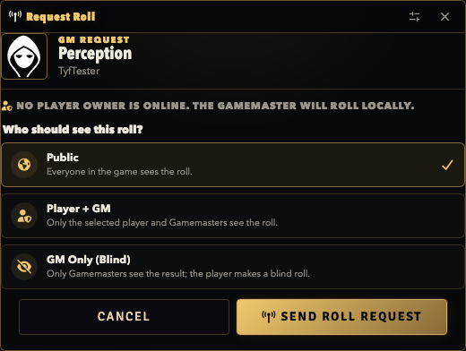

### Active Tasks & Requests

Gamemasters can enable **Active Tasks & Requests** in the root settings to add
its Token Controls button. The panel remains closed until that button is used.
It lists outstanding GM Quickbar requests, the responsible player, and
their online status, failure state, and remaining lifetime. A request is
registered before delivery and disappears after the player rolls or cancels.
The queue is transient: closing the panel does not clear it, while reloading the
world deliberately does not replay unanswered decisions.

A Gamemaster may cancel a waiting request at any time. Cancellation is delivered
to the assigned player and closes that player's open roll builder without
creating chat, spending resources, or completing an action. **Take Over** remains
disabled while the assigned player is online. If that player disconnects or
delivery fails, Take Over first aborts the remote prompt and then opens the same
current Actor roll locally for the GM. The first completed path wins, preventing
the old player prompt and GM takeover from both resolving. Unanswered requests
expire and clean themselves up after five minutes.

Both quickbars are GM-only, per-user display preferences. Enabling either
setting makes its toolbar button available but never opens its window
automatically. Turning either setting off closes that panel immediately without
changing game data and removes its button from Token Controls. Use the enabled
button to open, close, reopen, or recover a quickbar after closing it with the
window control.

All system interfaces use OpenD6 Next as their canonical design baseline:
typography, window treatment, spacing, controls, focus states, empty states,
roll presentation, and responsive behavior should feel like the same product.
Edition-specific differences describe rules and available data, not a separate
or simplified UI theme.

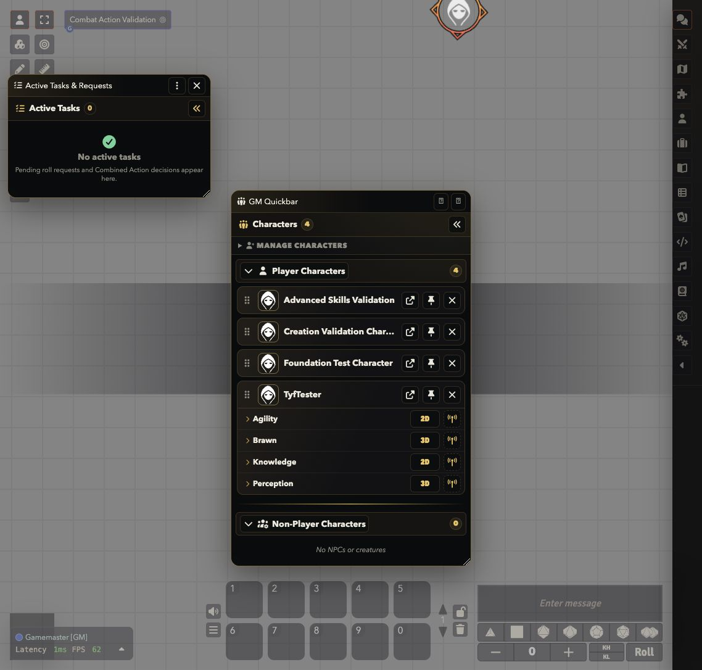

Players can use owned Actors, roll, advance through the selected protected
workflow, and update permitted narrative fields. They cannot:

- enter Free Edit;
- directly write mechanical pip scores in Normal mode;
- bypass advancement transactions;
- create protected embedded mechanical Items outside supported workflows; or
- directly correct authoritative combat state after resolution begins.

The Gamemaster can use Free Edit, synchronize catalogs, correct resources,
manage campaign settings, and perform the documented combat corrections.

The system exposes a versioned public API through `game.system.api`. Supported
capabilities include Actor read models, rolls and follow-ups, advancement,
health Conditions, campaign/rules profiles, combat commands, terminology, and
themes. Macros and modules must negotiate the supported API version and must not
import private source files or recalculate system rules.

The advancement API exposes Attribute and existing-Item improvements plus
`advancement.specialization(actor, parentSkillId, name)` for the same protected
Second Edition specialization-acquisition transaction used by the character
sheet. `advancement.milestone` exposes read, award, and Perk-exchange commands;
`advancement.narrative` exposes read, propose, approve, step-toggle, complete,
and remove commands. Every command applies the same owner/GM and active-profile
checks as the sheet.

### Token Action HUD

Install and enable **Token Action HUD Core** and **Token Action HUD — D6 System
Second Edition** to expose the selected token's common actions without opening
its sheet. The adapter provides:

- the current round declaration, penalty, and next-action command;
- rollable Attributes and Skills;
- equipped character-weapon attack and damage rolls;
- equipped Vehicle and Starship weapon crew attacks and damage rolls; and
- available Trouble and Asset invocations with visible session-use counts.

The HUD uses the same protected system commands as the Actor sheet. Ownership,
revision conflicts, Trouble/Asset limits, Hero Point awards, declared-action
penalties, roll dialogs, and chat results therefore remain authoritative. A GM
may reset a combat declaration from the HUD when the underlying combat command
allows it. Machine weapon Attack opens the same assigned-gunner selection used
by the sheet; ownership and Starship minimum-crew penalties remain
system-authoritative.

Token Action HUD Core controls whether categories open on hover or click and
whether subgroups may remain collapsed. If a category is visible but its actions
are not, hover the category or enable **Click to Open** in Token Action HUD Core;
also expand any collapsed subgroup. These are personal HUD presentation
settings and do not remove the system actions.

Token Action HUD and companion modules remain presentation adapters. Dice So
Nice is optional and never changes rules resolution.

## 13. Vehicles, Starships, and Creatures

### Vehicle and starship sheets

Create a **Vehicle** or **Starship** from the Actors sidebar. Their dedicated
ApplicationV2 sheets use the same OpenD6 Next visual components as character
sheets, with four task workspaces:

- **Systems** holds the machine's source-backed Die Codes and operational
  profile.
- **Combat** presents Defense, resistance, repair difficulties, Conditions, and
  weapons.
- **Cargo & Equipment** manages scale-appropriate gear and armor.
- **Vessel Notes** stores campaign-specific configuration and history.

A Vehicle stores Maneuverability, Hull, passenger capacity, Armor, and Scale
(D62e pp. 181–183). A Starship stores Navicomp, Maneuverability, Engines, Hull,
minimum crew, Shields, and Scale (D62e pp. 176–181). Values use the same
canonical pip-unit storage as character Die Codes; the active Pips capability
controls their visible `xD+y` projection. Editable fields save when focus leaves
the control; reopening the sheet reads the persisted document values.

To outfit a machine from a compendium, drag Armor or the matching Vehicle or
Starship Gear/Weapon entry anywhere onto its sheet. Foundry copies the Item into
that machine; it does not move or modify the compendium source. An owner can use
the trash button in **Cargo & Equipment** to remove copied gear after a clear
confirmation. Personal Gear and Weapons, or content for the other machine
family, are rejected instead of being attached incorrectly.

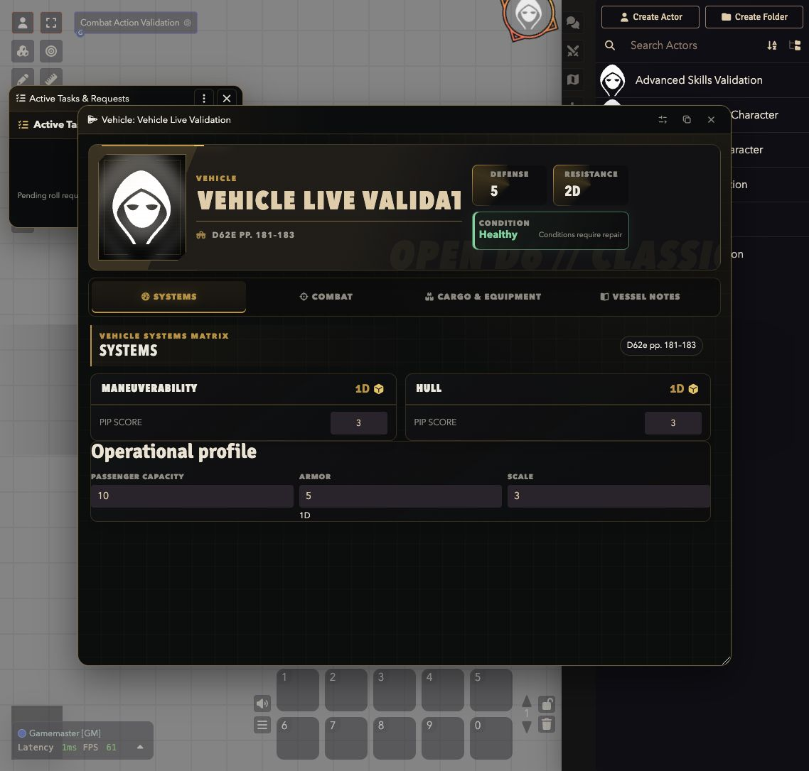

Select a system heading to use the shared typed roll builder. Defense is five
times the full Hull dice. Resistance combines Hull with Armor for Vehicles or
Shields for Starships. The Combat workspace can roll a weapon's damage and
stores the shared Condition track. When a targeted Damage card names a Vehicle
or Starship, the GM-only **Resolve damage** action rolls this resistance, applies
the same Condition progression used for characters, and records Hull plus
protection and the outcome on the original card. Machine resolution does not
spend Hero Points, change personal posture, or forfeit a crew Actor's actions.

Machines do not naturally recover from Conditions. For Stunned, Wounded,
Incapacitated, or Mortally Wounded machines, **Repair machine** selects an owned
repairer and rolls Repair under Mechanical, falling back to untrained
Mechanical. The printed difficulties are locked at 10, 15, and 20 respectively
(Wounded and Incapacitated both use 15). Success removes the machine Condition;
failure leaves it unchanged. The book assigns no repair difficulty to
Staggered, Healthy, Dead, or other states, so those remain manual GM decisions.

Use **Add crew** on the Systems workspace to assign owned Character, Creature,
or NPC Actors. Crew entries open their source Actor and can be removed only
after confirmation. Select **Attack** on a mounted weapon to choose an assigned
gunner. The roll uses that Actor's Gunnery (or Mechanical when untrained), adds
the weapon attack bonus, and retains the crew Actor's action economy and Hero
Points. Starships automatically subtract 1D for every assigned crewmember below
their Minimum Crew (D62e pp. 177, 180, 182). The roll builder still derives
target, range, Defense, and scale from the machine and weapon, and the chat card
audits every contributor.

When the Open D6 First Edition strategy is selected, Second Edition machine data
is preserved and clearly marked; it is not silently treated as First Edition
vehicle combat, and the Second Edition machine damage/repair actions are hidden.

### Creature defenses

Creature sheets normally derive Dodge and Parry like characters. In GM
**Free Edit**, the Combat tab also exposes optional static overrides. A positive
override replaces the derived value; zero restores the standard calculation.
This models the deliberate exceptions described on D62e p. 132.

### Bestiary Creature profiles

Creature profiles created from the GM **Creature Catalog** retain their catalog,
entry, owner, contract version, and printed source on the Combat workspace.
Their Attributes support the higher Die Codes used by the D62e bestiary without
raising the 5D character-creation maximum. Profiles also receive the campaign's
active Skill catalog and may include registered Armor, Gear, Manifestations,
Special Abilities, or Weapons. See D62e pp. 165–167.

The supplied Dragon, Giant, Fairy Nuisance, and Zombie profiles contain their
usable numerical facts and concise original reminders without reproducing the
book's descriptive prose, examples, page design, or art. Natural-attack damage
such as **Brawn +1D** remains visible as a formula for the GM to resolve.

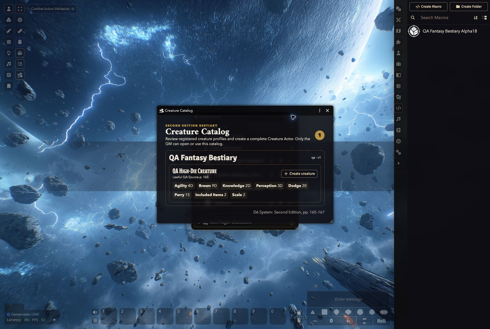

## 14. Current Boundaries

This alpha implements a substantial character, roll, advancement, Item, and
combat foundation, but it is not feature-complete. Important planned or blocked
areas include:

- chase Distance remains abstract and never moves Tokens because D62e pp. 73–74
  provide no spatial route or distance;
- later extranormal disciplines and genre modules;
- live player verification of crew-operated attacks from the Token Action HUD;
- licensed content supplied through approved companions.

The system deliberately leaves these visible as planned, deferred, or blocked
instead of filling gaps with rules from another D6 edition.
