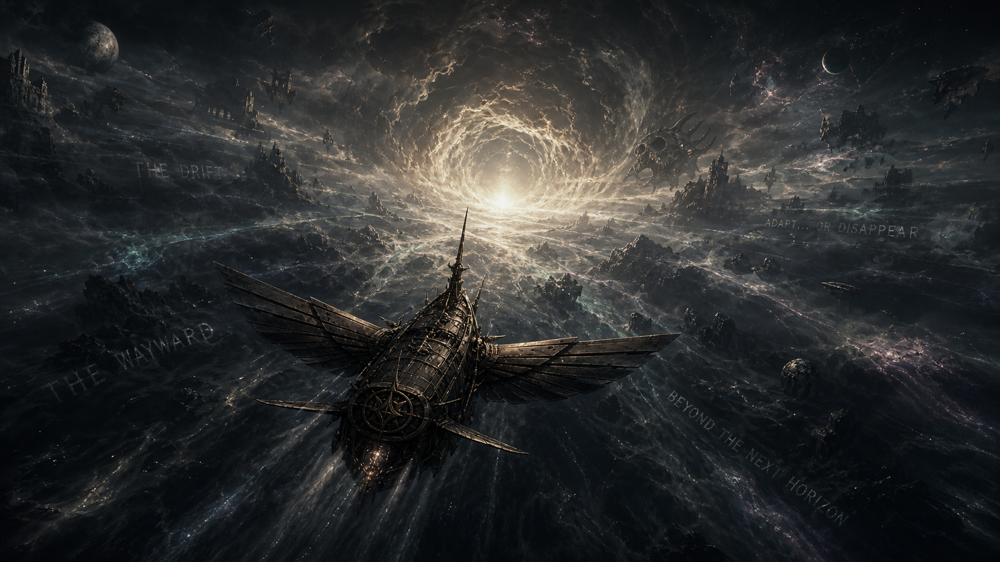

# The Echo D6 Companion

## Echo

One moment you were living an ordinary life. The next, you awaken at Authority
Arrival among bewildered newcomers drawn from countless worlds and are given a
choice: adapt… or disappear.

Assigned to the aging traversal vessel _The Wayward_, your new life begins upon
the Drift—the mysterious expanse between realities. Every expedition may reveal
a forgotten civilization, an impossible treasure, an ancient predator, or
another piece of the truth behind your arrival.

Echo is a campaign of exploration, mystery, and high adventure across realms
inspired by history, mythology, pulp adventure, and science fantasy. Read the
complete setting introduction in [`SETTING.md`](SETTING.md).

The companion includes a cinematic campaign landing image at
`art/scenes/echo-start-scene.png`, ready to use as the background for a Foundry
welcome or start scene.

## Foundry module

This Foundry VTT v14 companion ports the existing Echo D6 companion to
**D6 System Second Edition**. It is designed for the system's **Open D6 First
Edition** game mode with the **Open D6 Space** genre module.

The module contributes an Echo campaign-package choice, an optional burnished
bronze, warm ivory, and near-black Echo theme whose paused-game rings contain
the Echo logo, selected-only terminology and logo branding, and a GM action that applies the
system's public `open-d6` recommended-rules preset. It uses only the versioned
public system API and does not read or write private system settings.

## Use

1. Enable **Open D6 Space** and **The Echo D6 Companion** in Manage Modules.
2. Open System Settings and select **Open D6 First Edition** game mode.
3. Under Campaign Packages, select **Open D6 Space** and then **Echo D6**.
4. Optionally choose the **Echo D6** visual theme.
5. To adopt the recommended Open D6 rule profile, use the module setting
   **Apply Echo Recommended Rules**. This changes rule settings and is separate
   from selecting the companion or theme.

Echo terminology and sheet logos are inactive until Echo D6 is selected as the
campaign companion.

The selected companion labels the system-owned Credits, Faction Allegiance,
vehicle/starship toughness, interstellar-drive, manifestation, and Metaphysics
surfaces. It does not add private Actor fields or calculate rules.

## Compendiums

The module adds a **Setting Companions → Echo D6** Compendium folder with:

- empty, unlockable shells for **Characters**, **Character Templates**,
  **Equipment**, **Powers**, and **Vehicles & Starships**, ready for gradual
  manual development.

The legacy Echo companion did not contain content catalogs to import. A GM can
right-click a shell, open **Configure Compendium**, temporarily unlock it, and
drag world Actors or Items into it. Lock it again when editing is finished.
Because module updates can replace bundled packs, source-backed additions should
eventually be copied into `content/catalog.json` and the deterministic builder.
